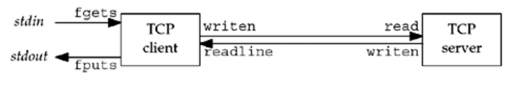

# 5.TCP客户/服务器程序示例


<!-- @import "[TOC]" {cmd="toc" depthFrom=1 depthTo=6 orderedList=false} -->
<!-- code_chunk_output -->

* [5.TCP客户/服务器程序示例](#5tcp客户服务器程序示例)
	* [概述](#概述)
	* [服务器程序](#服务器程序)
		* [退出函数](#退出函数)
	* [客户端程序](#客户端程序)
	* [链接器如何解析多重定义的全局符号](#链接器如何解析多重定义的全局符号)
	* [tcpdump](#tcpdump)
		* [Wireshark](#wireshark)
	* [netstat](#netstat)
	* [posix信号处理](#posix信号处理)
		* [POSIX 信号语义](#posix-信号语义)
	* [处理SIGCHLD信号](#处理sigchld信号)
	* [处理被中断的系统调用](#处理被中断的系统调用)
	* [wait和waitpid函数](#wait和waitpid函数)
	* [服务器进程终止](#服务器进程终止)
	* [SIGPIPE信号](#sigpipe信号)
	* [服务器主机崩溃](#服务器主机崩溃)
	* [服务器主机崩溃后重启](#服务器主机崩溃后重启)
	* [服务器主机关机](#服务器主机关机)

<!-- /code_chunk_output -->

## 概述

编写一个简单的回射客户/服务器
1. 客户从标准输入读入一行文本，并写给服务器
2. 服务器从网络输入读入这行文本，并回射给客户
3. 客户从网络输入读入这行回射文本，并显示在标准输出上

* 如图所示




## 服务器程序

```c
#include "unp.h"

void str_echo(int sockfd) {
  ssize_t n;
  char buf[MAXLINE];

again:
  while ((n = read(sockfd, buf, MAXLINE)) > 0)
    Write(sockfd, buf, n);

  // EINTR  The accept() function was interrupted by a  signal  that  was  caught  before  a  valid  connection
  // arrived.
  if (n < 0 && errno == EINTR)
    goto again;

  else if (n < 0)
    err_sys("str_echo:read error");
}

int main(int argc, char const *argv[]) {
  int listenfd, connfd;
  pid_t childpid;
  socklen_t clilen;
  struct sockaddr_in cliaddr, servaddr;

  listenfd = Socket(AF_INET, SOCK_STREAM, 0);

  bzero(&servaddr, sizeof(servaddr));
  servaddr.sin_family = AF_INET;
  servaddr.sin_addr.s_addr = htonl(INADDR_ANY);
  servaddr.sin_port = htons(SERV_PORT);

  Bind(listenfd, (SA *)&servaddr, sizeof(servaddr));

  Listen(listenfd, LISTENQ);

  while (1) {
    clilen = sizeof(cliaddr);
    connfd = Accept(listenfd, (SA *)&cliaddr, &clilen);

    if ((childpid = Fork()) == 0) {
      Close(listenfd);
      str_echo(connfd);

      //care
      exit(0);
      //见下面的退出函数

    }
    Close(connfd);
  }
  return 0;
}

```

### 退出函数

```c
#include <stdlib.h>

void exit(int status);
void _Exit(int status);

#include <unistd.h>

void _exit(int status);

```

3个函数用于正常终止一个程序，\_exit 和 \_Exit立即进入内核，exit先执行一些清理处理，然后返回内核。

可以使用atexit函数来登记多至32个的终止处理函数，这些函数由exit自动调用。

```c
#include <stdlib.h>

int atexit(void (*func) (void));
```

## 客户端程序

```c
#include "unp.h"

void str_cli(FILE *fp, int sockfd) {
  char sendline[MAXLINE], recvline[MAXLINE];
  while ((Fgets(sendline, MAXLINE, fp)) != NULL) {
    Write(sockfd, sendline, strlen(sendline));

    if (Readline(sockfd, recvline, MAXLINE) == 0)
      err_quit("str_cli:server terminated prematurely");
    Fputs(recvline, stdout);
  }
}

int main(int argc, char const *argv[]) {
  int sockfd;

  struct sockaddr_in servaddr;

  if (argc != 2) {
    err_quit("usage:tcpcli <IP address>");
  }

  sockfd = Socket(AF_INET, SOCK_STREAM, 0);

  bzero(&servaddr, sizeof(servaddr));
  servaddr.sin_family = AF_INET;
  servaddr.sin_port = htons(SERV_PORT);

  Inet_pton(AF_INET, argv[1], &servaddr.sin_addr);

  Connect(sockfd, (SA *)&servaddr, sizeof(servaddr));

  str_cli(stdin, sockfd);

  return 0;
}

```

## 链接器如何解析多重定义的全局符号

* 详见 深入理解计算机系统 7.6.1

函数和已初始化的全局变量是强符号，未初始化的全局变量是弱符号。


根据强弱符号的定义，unix链接器使用下面的规则来处理多重定义的符号：
1. 不允许有多个强符号
2. 如果有一个强符号和多个弱符号，那么选择强符号
3. 如果有多个弱符号，那么从这些弱符号中任意选择一个

规则2和规则3的应用会造成一些不易察觉的运行时错误，对于不警惕的程序员来说，这是很难理解的，尤其当如果重复的符号定义还有不同的类型时。

考虑下面的例子：

```c
//foo5.c
#include <stdio.h>

void f(void);

int x=15213;
int y=15212;

int main(int argc, char const *argv[]) {
  f();
  printf("x=0x%x  y=0x%x \n",x,y );
  return 0;
}
```

```c
//bar5.c

double x;
void f()
{
  x=-0.0;
}
```

double 8 byte,int 4 byte。因此，bar5.c的x=-0.0将用负零的双精度浮点表示覆盖存储器中的x和y的位置。

```
gcc -o foobar5 foo5.c bar5.c

/usr/bin/ld: Warning: alignment 4 of symbol `x' in /tmp/ccPxoo2Q.o is smaller than 8 in /tmp/cc26wO2g.o

./foobar5

x=0x0 y=0x800000000
```

```c
//foo51.c
#include <stdio.h>

void f(void);

int x=15213;
int y=15212;

int main(int argc, char const *argv[]) {
  f();
  printf("x=0x%x  y=0x%x \n",x,y );
  return 0;
}
```

```c
//bar51.c

double x;
void f()
{
  x=0.0;
}
```

show:
```
x=0x0  y=0x0
```

## tcpdump
[tcpdump](https://zh.wikipedia.org/wiki/Tcpdump) 是一个运行在命令行下的嗅探工具。它允许用户拦截和显示发送或收到过网络连接到该计算机的TCP/IP和其他数据包。tcpdump 是一个在BSD许可证下发布的自由软件。

tcpdump能够分析网络行为，性能和应用产生或接收网络流量。它支持针对网络层、协议、主机、网络或端口的过滤，并提供and、or、not等逻辑语句来帮助你去掉无用的信息，从而使用户能够进一步找出问题的根源。

也可以使用 tcpdump 的实现特定目的，例如在路由器和网关之间拦截并显示其他用户或计算机通信。通过 tcpdump 分析非加密的流量，如Telnet或HTTP的数据包，查看登录的用户名、密码、网址、正在浏览的网站内容，或任何其他信息。因此系统中存在网络分析工具主要不是对本机安全的威胁，而是对网络上的其他计算机的安全存在威胁。

简单使用:
```sh
tcpdump host $IPAddress -vv -X
```

[tcpdump Tutorial](https://danielmiessler.com/study/tcpdump/)

### Wireshark
Wireshark（前称Ethereal）是一个免费开源的网络数据包分析软件。网络数据包分析软件的功能是截取网络数据包，并尽可能显示出最为详细的网络数据包数据。

[fedora install Wireshark](https://fedoramagazine.org/how-to-install-wireshark-fedora/)

## netstat

In computing, [netstat](https://en.wikipedia.org/wiki/Netstat) (network statistics) is a command-line network utility tool that displays network connections for the Transmission Control Protocol (both incoming and outgoing), routing tables, and a number of network interface (network interface controller or software-defined network interface) and network protocol statistics. It is available on Unix-like operating systems including macOS, Linux, Solaris, and BSD, and is available on Windows NT-based operating systems including Windows XP, Windows Vista, Windows 7, Windows 8 and Windows 10.


## posix信号处理

信号就是告知某个进程发生了某个事情的通知，有时也称为软件中断。信号通常是异步发生的，也就是说进程预先并不知道信号的准确发生时刻。

信号可以：
* 由进程发给另一个进程（或自身）
* 由内核发给某个进程

SIGHLD信号就是内核在任何一个进程终止时发给他的父进程的一个信号

有两个信号不能被捕获，他们是SIGKILL和SIGSTOP：他们向内核和超级用户提供了使进程终止或停止的可靠方法。

调用POSIX sigaction函数的signal函数

```c
#include "unp.h"

Sigfunc * signal(int signo,Sigfunc *func)
{
	struct sigaction act,oact;

	act.sa_handler=func;
	sigemptyset(&act.sa_mask);
	act.sa_flags=0;

	//省略平台可移植的处理

	if (sigaction(signo,&act,&oact)<0)
	return (SIG_ERR);
	return (oact.sa_handler);

}
```

用typedef简化函数原型

signal函数原型
```c
void (* signal(int signo,void (* func)(int))) (int);
```
为了简化，在unp.h中定义了如下Sigfunc类型：
```
typedef void Sigfunc(int)
```

### POSIX 信号语义

符合POSIX的系统上的信号处理：
* 一旦安装了信号处理函数，他便一直安装着
* 在一个信号处理函数运行期间，正在提交的信号是阻塞的。而且，安装处理函数时在传递给sigaction的函数的sa_mask信号集中指定的任何额外信号也被阻塞
* 如果一个信号在被阻塞间产生了一次或多次，那么该信号被解阻塞之后通常只递交一次，也就是说unix信号默认是不排队的
* 利用sigprocmask函数选择性地阻塞或解阻塞一组信号是可能的。这使得我们可以做到在一段临界区代码执行期间，防止捕获某些消息，以此保护这段代码

## 处理SIGCHLD信号

* 孤儿进程
一个其父进程已终止的进程称为孤儿进程，这种进程由init进程“收养”

* 孤儿进程组
该组中每个成员的父进程要么是该组的一个成员，要么不是该组所属会话的成员。对孤儿进程组的另一种描述可以是：一个进程组不是孤儿进程组的条件是-改组中有一个进程，其父进程在属于同一会话的另一组中

* [僵死进程](https://zh.wikipedia.org/zh-cn/%E5%83%B5%E5%B0%B8%E8%BF%9B%E7%A8%8B)

我们显然不愿意留存僵死进程。他们占用内核中的空间，最终可能导致我们耗尽进程资源。无论何时我们fork子进程都得wait他们，以防止他们变成僵死进程。为此，建立了一个处理SIGCHLD信号的信号处理函数：
```c
Signal(SIGCHLD，sig_chld);
```
```c
#include "unp.h"

void sig_chld(int signo)
{
	pid_t pid;
	int stat;

	pid=wait(&stat);
	printf("child %d terminated\n",pid );
	return ;
}
```

## 处理被中断的系统调用

我们用术语慢系统调用描述过accept函数，该术语也适用于那些可能永远阻塞的系统调用。

适用于慢系统调用的基本规则是：当阻塞于某个慢系统调用的一个进程捕获某个信号且相应的信号处理函数返回试，该系统调用可能返回一个EINTR错误。

为了处理被中断的accept，我们可以做如下更改：

```c
while (1) {
	clilen=sizeof(cliaddr);
	if ((connfd=accept(listenfd,(SA *)&cliaddr,&clilen))<0)
	{
		if (errno== EINTR)
			continue;
		else
			err_sys（"accept error"）;
	}
}
```

对于accept以及诸如read,write,select,open之类的函数来说，这个是合适。不过有一个函数我们不能重启：connect。如果该函数返回EINTR，我们就不能再次调用它，否则将立即返回一个错误。当connect被一个捕获ide信号中断而且不能自动重启时，我们必须调用select来等待连接完成。


为了帮助应用程序使其不必处理被中断的系统调用，4.3BSD后引进了某些被中断系统调用的自动重启动。自动重启动的系统包括：ioctl,read,readv,write,wirtev,wait和waitpid。但是这种自动重启动的处理方式也会带来问题，某些应用程序并不希望这些函数被中断后重启动为此4.3BSD允许进程基于每个信号禁用此功能。[摘自APUE10.5]()


| function | system   | 被中断系统调用的自动重启动？
| :- | :- |:-|
| signal     | linux       | 默认|
|sigaction |linux | 可选


[How to know if a Linux system call is restartable or not?](https://stackoverflow.com/questions/13357019/how-to-know-if-a-linux-system-call-is-restartable-or-not)


## wait和waitpid函数

```c
#include <sys/wait.h>

pid_t wait(int *statloc);
pid_t waitpid(pid_t pid,int *statloc,int options);
```

这两个函数的区别：
* 在一个子进程终止前，wait使其调用者阻塞，而waitpid有一选项，可使调用者不阻塞。
* waitpid并不等待在其调用之后的第一个终止子进程，它有若干个选项，可以控制它所等待的进程。

这两个函数的参数statloc指向终止状态，若不关心终止状态，可将该参数指定为空指针。

检查wait和waitpid所返回的终止状态的宏

| define | info     |
| :------------- | :------------- |
| WIFEXITED(status)       | 若为正常终止的子进程返回的状态，则为真      |
|WIFSIGNALED(status) | 若为异常终止子进程返回的状态，则为真 |
|WIFSTOPPED(status) | 若为当前暂停子进程的返回状态，则为真
|WIFCONTINUED（status）| 若在作业控制暂停后已经继续的子进程返回了状态，则为真 （仅用于waitpid）


看下面的例子：

与服务器建立了5个连接的TCP客户程序
```c
#include "unp.h"

int main(int argc, char const *argv[]) {
	int i,sockfd[5];

	struct sockaddr_in servaddr;

	if (argc!=2)
		err_quit("usage:tcpcli<IPAddress>");

	for (i=0;i<5;i++)
	{
		sockfd[i]=Socket(AF_INET,SOCK_STREAM,0);
		bzero(&servaddr,sizeof(servaddr));
		servaddr.sin_family=AF_INET;
		servaddr.sin_port=htons(SERV_PORT);
		Inet_pton(AF_INET,argv[1],&servaddr.sin_addr);

		Connect(sockfd[i],(SA *)&servaddr,sizeof(servaddr));

	}
	str_cli(stdin,sockfd[0]);

	exit(0);
}
```

当客户终止时，且所有5个连接基本在同一时刻终止。这就引发5个FIN，他们反过来使服务器的5个连接基本在同一时刻终止。这又导致差不多在同一时刻有5个SIGCHLD信号递交给父进程。但unix信号一般是不排队的。使用之前的sigchld信号处理函数会产生4个僵死进程。

最终正确的SIGCHLD处理函数：
```c
#include "unp.h"

void sig_chld（int signo）
{
	pid_t pid;

	int stat;

	while((pid=waitpid(-1,&stat,WNOHANG))>0)
		printf("child %d terminated\n",pid );
		return;
}
```


处理accept返回EINTR错误的TCP服务器最终正确版本：
```c
#include "unp.h"

int main(int argc, char const *argv[]) {
	int listenfd,connfd;

	pid_t childpid;
	socklen_t clilen;
	struct sockaddr_in cliaddr,servaddr;
	void sig_chld(int);

	listenfd=Socket(AF_INET,SOCK_STREAM,0);

	bzero(&servaddr,sizeof(servaddr));
	servaddr.sin_family=AF_INET;
	servaddr.sin_port=htons(SERV_PORT);
	servaddr.sin_addr.s_addr=INADDR_ANY;

	Bind(listenfd,(SA *)&servaddr,sizeof(servaddr));


	Listen(listenfd,LISTENQ);

	Signal(SIGCHLD,sig_chld);

	while (1) {
		clilen=sizeof(cliaddr);

		if ((connfd=accept(listenfd,(SA *) &cliaddr),&clilen)<0)
		{
			if (errno==EINTR)
				continue;
			else
				err_sys("accept error");

		}

		if ((childpid=Fork())==0)
		{
			Close(listenfd);
			str_echo(connfd);
			exit(0);
		}
		Close(connfd);
	}
	return 0;
}
```

## 服务器进程终止

1. 我们在同一主机上启动服务器和客户端，并在客户上键入一行文本，以验证一切正常。
2. 找到服务的子进程的进程ID，并执行kill命令杀死它。
3. SIGCHLD信号被发送给服务器父进程，并得到正确处理
4. 客户上没有发生任何特殊的事情。客户TCP接收来自服务器的FIN并响应一个ACK，然而问题是客户进程阻塞在fgets调用上，等待从终端接受一行文本
5. 运行netstat命令，可以看到TCP连接终止序列的前半部分已经完成
6. 我们从客户上在键入一行文本，这时，显示“server terminated prematurely”,并终止
7. 当服务器TCP接收来自客户的数据时，既然先前打开的那个套接字的进程已经终止，于是响应一个RST。然而客户进程看不到这个RST，因为他在调用writen后立即调用readline，并且由于第二步中接收的FIN，所调用的readline立即返回0（表示EOF）。出错退出。
8. 当客户终止时（通过调用err_quit），它所打开着的描述符都被关闭。

本例子的问题在于：当FIN到达套接字时，客户正阻塞在fgets调用上。客户实际上在应对两个描述符-套接字和用户输入。


## SIGPIPE信号

如果在管道的读进程已终止的时候写管道，则产生此信号。

产生该信号的修改就是调用wirten两次：第一次把文本行数据的，暂停一秒钟后，第二次把同一文本行中剩余字节写入套接字。目的是让第一次writen引发一个RST，在让第二个writen产生SIGPIPE。

调用writen两次从的str_cli函数：
```c
#include	"unp.h"

void
str_cli(FILE *fp, int sockfd)
{
	char	sendline[MAXLINE], recvline[MAXLINE];

	while (Fgets(sendline, MAXLINE, fp) != NULL) {

		Writen(sockfd, sendline, 1);
		sleep(1);
		Writen(sockfd, sendline+1, strlen(sendline)-1);

		if (Readline(sockfd, recvline, MAXLINE) == 0)
			err_quit("str_cli: server terminated prematurely");

		Fputs(recvline, stdout);
	}
}
```

结果:
```
./tcpcli11 127.0.0.1

hi there 我们键入这行文本
hi there 被服务器回射回来
		 在这杀死服务器子进程
bye 	然后键入这行文本
		进程收到SIGPIPE终止了
```

[Why is port not immediately released after the socket closes?](https://stackoverflow.com/questions/22549044/why-is-port-not-immediately-released-after-the-socket-closes)


## 服务器主机崩溃

1. 当服务器主机崩溃时，已有的网络连接不发出任何东西。这里我们假设的是主机崩溃，而不是由操作员执行命令关机。
2. 我们在客户上键入一行文本，它由writen写入内核，再由T客户TCP作为一个数据分节送出。客户随后阻塞于readline调用，等待回射的应答。
3. 客户TCP会持续重传数据分节，试图从服务器上接收一个ACK。源自Berkley的实现重传该数据分节12次，共等待约9分钟才放弃重传。


## 服务器主机崩溃后重启

如果在服务器主机崩溃是客户不主动给服务器发送数据，那么客户将不会知道服务器主机已经崩溃。（这里我们假设没有使用SO_KEEPALIVE套接字选项）。所发生的步骤如下：
1. 我们启动服务器和客户，并在客户键入一行文本以确认连接已经建立
2. 服务器主机崩溃并重启
3. 在客户上键入一行文本，他将作为一个TCP数据分节发送给服务器主机
4. 当服务器主机崩溃后重启时，他的TCP丢失了崩溃前的连接信息，因此服务器TCP对于所收到的来自客户的数据分节响应一个RST
5. 当客户TCP收到该RST时，客户正阻塞于readline调用，导致该调用返回ECONNRESET错误

## 服务器主机关机
和服务器进程终止讨论的一样


[上一级](README.md)
[上一篇](4_basic_tcp_socket.md)
[下一篇](6_select_poll_function.md)
