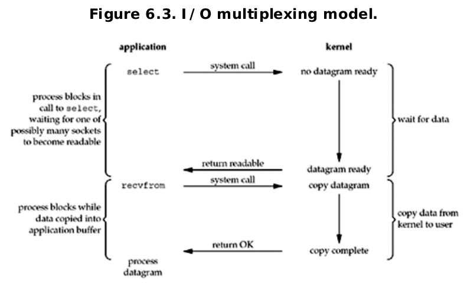

# 6.I/O多路复用：select(),poll(),epoll()函数


<!-- @import "[TOC]" {cmd="toc" depthFrom=1 depthTo=6 orderedList=false} -->
<!-- code_chunk_output -->

* [6.I/O多路复用：select(),poll(),epoll()函数](#6io多路复用selectpollepoll函数)
	* [概述](#概述)
	* [I/O模型](#io模型)
		* [阻塞式I/O](#阻塞式io)
		* [非阻塞式I/O](#非阻塞式io)
		* [I/O复用](#io复用)
		* [信号驱动I/O模型](#信号驱动io模型)
		* [异步I/O模型](#异步io模型)
		* [同步I/O和异步I/O对比](#同步io和异步io对比)
	* [select 函数](#select-函数)
		* [timeout参数：](#timeout参数)
		* [readset、writeset、exceptset参数](#readset-writeset-exceptset参数)
		* [maxfdp1参数](#maxfdp1参数)
		* [描述符就绪条件](#描述符就绪条件)
			* [套接字准备好读](#套接字准备好读)
			* [一个套接字准备好写](#一个套接字准备好写)
			* [错误就绪](#错误就绪)
	* [str_cli函数（修订版）](#str_cli函数修订版)
	* [批量输入](#批量输入)
	* [shutdown函数](#shutdown函数)
	* [str_cli函数（再修订版）](#str_cli函数再修订版)
	* [TCP回射服务器程序](#tcp回射服务器程序)
		* [拒绝服务型攻击](#拒绝服务型攻击)
	* [pselect函数](#pselect函数)
	* [poll函数](#poll函数)
		* [第一个参数](#第一个参数)
		* [第二个参数](#第二个参数)
		* [第三参数](#第三参数)
	* [TCP回射服务器程序（再修订版）](#tcp回射服务器程序再修订版)
	* [部分习题](#部分习题)
	* [补充：事件驱动和回调函数](#补充事件驱动和回调函数)
	* [epoll函数](#epoll函数)
		* [epoll接口](#epoll接口)
	* [select、poll、epoll的区别](#select-poll-epoll的区别)

<!-- /code_chunk_output -->

## 概述

在前一章的服务器进程终止一节中，当FIN到达套接字时，客户正阻塞在fgets调用上。客户实际上在应对两个描述符-套接字和用户输入。

这样的进程需要一种预先告知内核的能力，使得内核一旦发现进程指定的一个或多个I/O条件就绪（也就是说输入已准备好被读取，或者描述符已能承接更多的输出），就通知进程。这个能力称为I/O复用，是由select和poll等函数支持的。

I/O多路复用典型使用在下列网络应用场合：
* 当客户处理多个描述符（通常是交互式输入和网络套接字）时，必须使用I/O复用。这是我们早先讨论过的场合
* 一个客户同时处理多个套接字时可能的，不过比较少见。
* 如果一个TCP服务器既要处理监听套接字，又要处理已连接套接字，一般就要使用I/O 复用
* 如果一个服务器既要处理TCP，又要处理UDP，一般使用I/O复用
* 如果一个服务器要处理多个服务或者多个协议，一般就要使用I/O复用

注：I/O复用 并非只限于网络编程，许多重要的应用程序也需要使用这项技术

## I/O模型

### 阻塞式I/O
最流行的I/O模型是阻塞式I/O模型，该书到目前为止的所有例子都使用该模型。默认情况下，所有套接字都是阻塞的。


进程调用recvfrom，其系统调用直到数据报到达且被复制到应用进程的缓冲区中或者发生错误才返回。

### 非阻塞式I/O

进程把一个套接字设置成非阻塞是在通知内核；当所请求的I/O操作非得把本进程投入睡眠才能完成时，不要把本进程投入睡眠，而是返回一个错误。


### I/O复用



### 信号驱动I/O模型
我们也可以使用信号，让内核在描述符就绪时发送SIGIO信号通知我们


我们首先需要开启套接字的信号驱动式I/O功能（25.2节会讲解），并通过并通过sigaction系统调用安装一个信号处理函数。

### 异步I/O模型


这个模型与前一节介绍的信号驱动模型的主要区别在于：信号驱动式I/O是由内核通知我们何时可以启动一个I/O操作，而异步I/O操作是由内核通知我们I/O操作何时完成。

我们调用aio_read函数（posix异步I/O函数以aio_ 或 lio_ 开头），给内核传递描述符、缓冲区指针、缓冲区大小和文件偏移，并告诉内核当整个操作完成时如何通知我们。

### 同步I/O和异步I/O对比

POSIX把这两个术语定义如下：
* 同步I/O操作导致请求进程阻塞，直到I/O操作完成；
* 异步I/O操作不导致请求进程阻塞


根据上述定义，我们的前4种模型-阻塞式、非阻塞式、I/O复用和信号驱动式I/O模型都是同步I/O模型，因为其真正的I/O操作（recvfrom）将阻塞进程。只有异步I/O模型与POSIX定义的异步I/O相匹配。


## select 函数

该函数允许进程指示内核等待多个事件中的任何一个发生，并只在有一个或多个事件发生或经历一段指定的时间后才唤醒它。


```c
#include <sys/select.h>
#include <sys/time.h>

int select(int maxfdp1,fd_set *readset,fd_set *writeset,fd_set *exceptset,const struct timeval *timeout);
//返回：若有就绪描述符则为其数目，若超时则为0，若出错则为-1
```


参数介绍：
### timeout参数：
它告知内核等待所指定描述符中的任何一个就绪可花多少时间。其中timeval结构用于指定这段时间的秒数和微妙数。
```c
struct timeval{
  long tv_sec;
  long tv_usec;
};
```
这个参数有三种可能。
1. 永远等待下去：仅在有一个描述符准备号I/O才返回。
为此，我们把该参数设置为空指针。
2. 等待一段固定的时间：在有一个描述符准备好I/O时返回，但是不超过由该参数所指向的timeval结构中指定的时间。
3. 根本不等待：检查描述符后立即返回，这称为轮询。为此timeval中的相关值需设为0。

注意：timeval结构能够表达select不支持的值。

### readset、writeset、exceptset参数
* 中间的三个参数readset、writeset、exceptset指定我们让内核测试读、写和异常条件的描述符。目前支持的异常条件只有两个：
1. 某个套接字的带外数据的到达，将在第24章讲述
2. 某个已设置为分组模式的伪终端存在可从其主端读取的控制状态信息。该书不讨论伪终端。

fd_set为描述符集的数据类型。

```c
void FD_ZERO(fd_set *fdset); //clear all bits in fdset;
void FD_SET(int fd,fd_set * fdset); //turn on the bit for fd in fdset
void FD_CLR(int fd,fd_set * fdset); //turn off the bit for fd in fdset
int FD_ISSET(int fd,fd_set *fdset); //is the bit for fd on in fdset ?
```

描述符集的初始化非常重要，因为作为自动变量分配的一个描述符集如果没有个初始化，那么可能发生不可预期的后果。

这三个参数，如果我们对某一个的条件不感兴趣，就可以把它设为空指针。事实上，如果这三个指针均为空，我们就有了一个比unix的sleep函数更为精确的定时器。

select函数修改由指针readset、writeset和exceptset指向的描述符集，因而这三个参数都是值-结果参数。调用该函数时，我们指定所关心的描述符的值，该函数返回时，结果将指示那些描述符已就绪。该函数返回后，我们可以使用FD—ISSET来测试fd_set数据类型中的描述符。描述符集中的任何与未就绪描述符对应的位返回时均清成0。

<span style="color:red">为此，每次重新调用select函数时，我们都得再次把所有描述符集内所关心的位均置为1。</span>.

### maxfdp1参数

指定待测试的描述符个数，他的值时待测的最大描述符加1，描述符0，1，2...，一直到maxfdp1-1均被测试

<span style="color:red">使用select函数最常见的两个编程错误是：
1.忘了对最大描述符加1  
2.忘了描述符集是值-结果-参数。第二个错误导致调用select时，描述符集内我们认为是1的位却被置为0
</span>.

### 描述符就绪条件

#### 套接字准备好读
1. 该套接字接收缓冲区中的数据字节数大于等于套接字接收缓冲区低水位标记好的的当前大小。对于这样的套接字执行读操作不会阻塞并将返回一个大于0的值（也就是返回准备好读入的数据）。我们可以使用SO_RCVLOWAT套接字选项设置该套接字的低水位标记。对于TCP和UDP，其默认值为1。

2. 该连接的读半部关闭（也就是接收了FIN的TCP连接）。对这样的套接字的读操作不会阻塞并返回0（也就是EOF）。

3. 该套接字是一个监听套接字且已完成的连接数不为0.对这样的套接字的accept通常不会阻塞。

4. 其上有一个套接字错误待处理。对这样的套接字的读操作将不阻塞，并返回-1，同时把errno设置为确切的条件。这些待处理错误也可以通过指定SO_ERROR套接字选项调用getsockopt获取并清除。

#### 一个套接字准备好写

1. 该套接字发送缓冲区中的数据字节数大于等于套接字发送缓冲区低水位标记好的的当前大小,并且或者该套接字已经连接，或者该套接字不需要连接（如UDP）。这意味着如果我们把这样的套接字设置为非阻塞，写操作将不阻塞并返回一个正值。我们可以使用我们可以使用SO_SNDLOWAT套接字选项来设置该套接字的低水位标记。

2. 该连接的写半部关闭。对这样的套接字的写操作将产生SIGPIPE信号

3. 其上有一个套接字错误待处理。详情同上

#### 错误就绪
如果一个套接字存在带外数据或者仍处于带外标记，那么它有异常条件待处理

注意：
当某个套接字上发生错误时，他将由select标记为即可读，又可写。

汇总上述导致select返回某个套接字就绪的条件

| condition | readable?    | writeable?| exception? |
| :------------- | :------------- | :- |:- |
| 有数据可读       |  Y      | N|N |
|关闭连接的读一半|Y |N|N
|给监听套接口准备好新连接|Y|N|N
|有可用于写的空间|N|Y|N
|关闭连接的写一半|N|Y|N
|待处理错误|Y|Y|N
|TCP带外数据|N|N|Y


## str_cli函数（修订版）

我们可以使用select来处理之前讨论的服务器终止问题。

str_cli函数中select处理的各种条件：


客户套接字上的三个条件处理如下：
1. 如果对端TCP发送数据，那么该套接字变为可读，并且read返回一个大于0的值（即读入数据的字节数）。
2. 如果对端TCP发送一个FIN（对端进程终止），那么该套接字变为可读，并且read返回0（EOF）。
3. 如果对端TCP发送一个RST（对端主机崩溃并重新启动），那么该套接字变为可读，并且返回-1，而errno中还有确切的错误代码。

使用select的str_cli函数的实现：
```c
#include "unp.h"

void str_cli(FILE *fp,int sockfd)
{
	int maxfdp1;
	fd_set rset;
	char sendline[MAXLINE],recvline[MAXLINE];

	FD_ZERO(&rset);

	while (1) {
		FD_SET(fileno(fp),&rset);
		//int fileno(FILE * stream);
		//The function fileno() examines the  argument  stream  and  returns  
		// its integer file descriptor.

		FD_SET(sockfd,&rset);
		maxfdp1=max(fileno(fp),sockfd)+1;
		Select(maxfdp1,&rset,NULL,NULL,NULL);

		if (FD_ISSET(sockfd,&rset))
		{
			if (Readline(sockfd,recvline,MAXLINE)==0)
				err_quit("str_cli:server terminated prematurely");
			Fputs(recvline,stdout);
		}

		if (FD_ISSET(fileno(fp),&rset))
		{
			if (Fgets(sendline,MAXLINE,fp)==NULL)
				return;
			Writen(sockfd,sendline,strlen(sendline));
		}
	}
}
```

## 批量输入
不幸的是，我们str_cli函数仍然是不正确的。

一般来说，为提升性能而引入缓冲机制增加了网络应用程序的复杂性，上面章节的代码就遭受这种复杂性之害。究其原因在于select不知道stdio使用了缓冲区-它只是从read系统调用的角度指出是否有数据可读，而不是从fgets之类调用的角度考虑。基于上述原因，<span style="color:red">混合使用stdio和select被认为是非常容易犯错误的，在这样做时必须极其小心</span>              


## shutdown函数
终止网络连接的通常方法时调用close函数。不过close有两个限制，却可以使用shutdown来避免。
1. close把描述符的引用计数减一，仅在该计数变为0时才关闭套接字。使用shutdown可以不管引用计数就激发TCP的正常连接终止序列。
2. close终止读和写两个方向的数据传送。

```c
#include <sys/socket.h>

int shutdown(int sockfd,int howto);
```

该函数的行为依赖于howto参数的值。

* SHUT_RD 关闭连接的读这——半-套接字中不再有数据可接收，并且套接字接收缓冲区中的现有数据都被丢弃。进程不能在对这样的套接字调用任何读函数。对一个TCP套接字这样调用shutdown函数后，由该套接字接收的来自对端的任何数据都被确认，然后悄然丢弃。

* SHUT_WR 关闭连接的写这一半——对于TCP套接字，这称为半关闭。当前留在套接字发送缓冲区中的数据将被发送掉，后跟TCP的正常连接终止序列

* SHUT_RDWR 连接的读半部和写半部都关闭

这三个SHUT_*名字是由POSIX规范定义，howto参数的典型值将会是0（关闭读半部）、1（关闭写半部）、2（读半部和写半部都关闭）

## str_cli函数（再修订版）

str_cli函数的改进（且正确）版本。这个版本还废弃了以文本为中心的代码，改而针对缓冲区操作，从而消除了前面提到的复杂性问题。
```c
#include "unp.h"

void str_cli(FILE * fp,int sockfd)
{
	int maxfdp1,stdineof;
	fd_set rset;
	char buf[MAXLINE];
	int n;

	stdineof=0;
	FD_ZERO(&rset);
	while (1) {
		if (stdineof==0)
			FD_SET(fileno(fp),&rset);
			FD_SET(sockfd,&rset);
			maxfdp1=max(fileno(fp),sockfd)+1;
			Select(maxfdp1,&rset,NULL,NULL,NULL);

			if (FD_ISSET(sockfd,&rset))
			{
				if ((n=Read(sockfd,buf,MAXLINE))==0)
				{
					if (stdineof==1)
						return ;
					else
						err_quit("str_cli:server terminated prematurely");
				}
				Writen(fileno(stdout),buf,n);
			}

			if (FD_ISSET(fileno(fp),&rset))
			{
					//if stdin input EOF
					if ((n=Read(fileno(fp),buf,MAXLINE))==0)
					{
						stdineof=1;
						Shutdown(sockfd,SHUT_WR);//send FIN
						FD_CLR(fileno(fp),&rset);
						continue;
					}
					Writen(sockfd,buf,n);
			}
	}
}
```

## TCP回射服务器程序

```c
#include "unp.h"

int main(int argc, char const *argv[]) {
	int i,maxi,maxfd,listenfd,connfd,sockfd;

	int nready,client[FD_SETSIZE];

	ssize_t n;
	fd_set rset,allset;
	char buf[MAXLINE];
	socklen_t clilen;
	struct sockaddr_in cliaddr,servadd;
	listenfd=Socket(AF_INET,SOCK_STREAM,0);

	bzero(&serveraddr,sizeof(servadd));
	servaddr.sin_family=AF_INET;
	servadd.sin_port.s_addr=htonl(INADDR_ANY);
	servadd.sin_port=htons(SERV_PORT);

	Bind(listenfd,(SA *)&servadd,sizeof(servadd));

	Listen(listenfd,LISTENQ);

	maxfd=listenfd; //initialize
	maxi=-1; //index into  client[] array

	for (i=0;i<FD_SETSIZE;i++)
		client[i]=-1; // -1 indicates available entry

	FD_ZERO(&allset);
	FD_SET(listenfd,&allset);

	while (1) {
		rset=allset; //structure assignment
		nready=Select(maxfd+1,&rset,NULL,NULL,NULL);

		if(FD_ISSET(listenfd,&rset)) //new client connection
		{
			clilen=sizeof(cliaddr);
			connfd=Accept(listenfd,(SA *)&cliaddr,&clilen);

			for (i=0;i<FD_SETSIZE;i++)
			{
				if (client[i]<0)
				{
					client[i]=connfd; //save descriptor
					break;
				}
			}

			if (i==FD_SETSIZE)
				err_quit("too many clients");

			FD_SET(connfd,&allset); //add new descriptor to set

			if (connfd > maxfd)
				maxfd=connfd; //for select

			if (i>maxi)
				maxi=i; //max index in client[] array

			if (--nready<=0)
			continue; //no more readable descriptor
		}

		for(i=0;i<=maxi;i++) //check all client for data
		{
			if ((sockfd=client[i])<0)
				continue;
			if (FD_ISSET(sockfd,&rset))
			{
				if ((n=Read(sockfd,buf,MAXLINE))==0)
				{
					Close(sockfd);
					FD_CLR(sockfd,&allset);
					client[i]=-1;
				}
				else
					Writen(sockfd,buf,n);
				if (--nready<=0)
					break; //no more readable descriptor
			}
		}
	}
	return 0;
}
```

### 拒绝服务型攻击

[拒绝服务型攻击 wiki](https://en.wikipedia.org/wiki/Denial-of-service_attack)

[僵尸网络 wiki](https://en.wikipedia.org/wiki/Botnet)

不幸的是，我们刚刚给出的服务器程序存在一个问题。

当一个服务器再处理多个客户时，它绝对不能阻塞于只与单个客户相关的某个函数调用。否则可能导致服务器被挂起，拒绝为所有的其他客户提供服务。这就是所谓的拒绝服务型攻击。它就是针对服务器做些动作，导致服务器不再能位其他合法客户提供服务。

可能的解决办法包括：
1. 使用非阻塞式I/O
2. 让每个客户由单独的控制线程提供服务
3. I/O操作设置一个超时

## pselect函数

pselect函数是由POSOX发明的，如今许多unix变种都支持它。
```c
#include <sys/select.h>
#include <signal.h>
#include <time.h>

int pselect(int maxfdp1,fd_set *readset,fd_set *writeset,fd_set *exceptset,const struct timespec *timeout,const sigset_t *sigmask);
//返回：若有就绪描述符则为其数目，若超时则为0，若出错则为-1
```

pselect相对于通常的select有两个变化。
1. pselect使用timespec结构，而不是使用timeval结构。timespec结构是POSIX的又一个发明。

pselect的timespec结构体：
```c
struct timespec{
	time_t tv_sec; //seconds
	long tv_nsec; //nanoseconds
};
```

select的timeval结构体：
```c
struct timeval{
	long tv_sec; //seconds
	long tv_usec; //microseconds
};
```


2. 增加了第6个参数：一个指向信号掩码的指针。该参数允许程序先禁止递交某些信号，再测试由这些当前被禁止信号的信号处理函数设置的全局变量，然后调用pselect，告诉它重新设置信号掩码。

示例：
```c
sigset_t newmask,oldmask,zeromask;

sigemptyset(&zeromask);
sigemptyset(&newmask);
sigaddset(&newmask,SIGINT);

sigprocmask(SIG_BLOCK,&newmask,&oldmask);//block SIGINT

if (intr_flag)
	handle_intr();

if ((nready=pselect(...,&zeromask))<0)
{
	if (errno=EINTR)
		{
			if(intr_flag)
				handle_intr();
		}
		...
}
```

## poll函数

poll函数起源于SVR3，最初局限于流设备（第31章）。不过SVR4取消了这种限制，允许poll工作再任何的描述符上。poll提供的功能与select类似，不过再处理流设备时，它能够提供额外的信息。
```c
#include <poll.h>

int poll(struct pollfd *fdarray,unsigned long nfds,int timeout);
//返回：若有就绪描述符则为其数目，若超时则为0，若出错则为-1
```
linux下新的函数原型为：
```c
#include <poll.h>

int poll(struct pollfd fds[], nfds_t nfds, int timeout);
```

### 第一个参数

第一个参数时指向一个结构数组第一个元素的指针。每个数组元素都是一个pollfd结构，用于指定测试某个给定描述符fd的条件。

```c
struct pollfd{
	int fd; //descriptor to check
	short events; // events of interest on fd
	short revents; //events that occurred on fd
};
```

要测试的条件由events成员指定，函数再相应的revents成员中返回该描述符的状态。这两个成员中的每一个都由指定某个特定条件的一位或多位构成。

下面列出了用于指定events标志以及测试revents标志的一些常值。

|常值 |作为events的输入吗？| 作为revents的结果吗？|说明|
|-|-|-|-|
| POLLIN(POLLWRNORM, POLLRDBAND的逻辑或)| Y|Y|普通或优先级带数据可读
|POLLRDNORM|Y|Y|普通数据可读
|POLLRDBAND|Y|Y|优先级带数据可读
|POLLPRI|Y|Y|高优先级数据可读
|POLLOUT|Y|Y|普通数据可写
|POLLWRNORM|Y|Y|普通数据可写
|POLLWRBAND|Y|Y|优先级带数据可写
|POLLERR|N|Y|发生错误
|POLLHUP|N|Y|发生挂起
|POLLNVAL|N|Y|描述符不是一个打开的文件

poll识别三类数据：普通（normal）、优先级带（priority band）和高优先级(high priority)。这些术语均出自于流的实现。

就TCP和UDP套接字而言，以下条件引起poll返回特定的revent。不幸的是，posix在其poll的定义中留下了许多空洞（也就是说有多种方法可返回相同的条件）。

* 所有正规TCP数据和所有UDP数据都被认为是普通数据
* TCP的带外数据（第24章） 被认为是优先级带数据
* 当TCP连接的读半部关闭时（譬如收到了一个来自对端的FIN），也就被认为时普通数据，随后的读操作将返回0
* TCP的连接存在错误即可认为时普通数据，也可认为时错误（POLLERR）。无论那种情况，随后的读操作都将返回-1，并把errno设置成合适的值。这可用于处理诸如接收到RST或发生超时等条件。
* 再监听套接字上有新的连接可用既可认为时普通数据，也可认为时优先级数据。大多数实现视只为普通数据
* 非阻塞式connect的完成被认为时使相应套接字可写

### 第二个参数

指定结构数组中元素的个数。

历史上曾被定义为unsigned long，似乎过分大了，定义为无符号整数可能就足够了。unix98为该函数定义了名为nfds_t的新的数据类型。

### 第三参数

timeout，指定poll函数返回前需要等待多长时间。它时一个指定等待毫秒数的正值。

|timeout|info|
|-|-|
|INFTIM|永远等待|
|0|立即返回，不阻塞进程|
|>0|等待指定数目的豪秒数|

## TCP回射服务器程序（再修订版）

我们现在使用poll替代select重写之前的TCP回射服务器程序。

```c
#include "unp.h"
#include <limits.h>

int main(int argc, char const *argv[]) {
	int i,maxi,listenfd,connfd,sockfd;
	int nready;
	ssize_t n;
	char buf[MAXLINE];
	socklen_t clilen;
	struct pollfd client[FOPEN_MAX];
	// in linux compile error :
	// 	error: ‘OPEN_MAX’ undeclared (first use in this function); did you mean ‘FOPEN_MAX’?
	// replace OPEN_MAX to FOPEN_MAX
	struct sockaddr_in cliaddr,servaddr;

	listenfd=Socket(AF_INET,SOCK_STREAM,0);

	bzero(&servaddr,sizeof(servaddr));
	servaddr.sin_family=AF_INET;
	servaddr.sin_addr.s_addr=htonl(INADDR_ANY);
	serveraddr.sin_port=htons(SERV_PORT);

	Bind(listenfd,(SA *)&servaddr,sizeof(servaddr));

	Listen(listenfd,LISTENQ);

	client[0].fd=listenfd;
	client[0].events=POLLRDNORM;
	for (i=1;i<FOPEN_MAX;i++)
		client[i].fd=-1; //-1 indicates available entry
	maxi=0; //max index into client[] array

	while (1) {
		nready=Poll(client,maxi+1,INFTIM);

		if (client[0].revents & POLLRDNORM){
			//new client connection
			clilen=sizeof(cliaddr);
			connfd=Accept(listenfd,(SA *)&cliaddr,&clilen);

			for (i = 0; i < FOPEN_MAX; i++) {
				if (client[i].fd<0)
				{
					client[i].fd=connfd; //save descriptor
					break;
				}
			}

			if (i==FOPEN_MAX)
				err_quit("too many clients");

			client[i].events=POLLRDNORM;

			if (i>maxi)
				maxi=i; //max index in client[] array

			if (--nready<=0)
				continue; //no more readable descriptor
		}

		for (i = 1; i < maxi; i++) {
			//check all clients for data
			if ((sockfd=client[i].fd)<0)
				continue;
			if (client[i].revents & (POLLRDNORM | POLLERR)){
				if ((n=read(sockfd,buf,MAXLINE))<0)			
					{
						if (errno==ECONNRESET){
							//connection reset by client
							Close(sockfd);
							client[i].fd=-1;
					}
					else
						err_sys("read error");
					}
				else if (n==0)
				{//connection closed by client
					Close(sockfd);
					client[i].fd=-1;
				}
				else
					Writen(sockfd,buf,n);

				if (--nready<=0)
					break; // no more readable descriptor
			}
		}
	}
	return 0;
}
```
## 部分习题

1. 在之前讨论select返回“可写”条件时，为什么必须限定套接字为非阻塞才可以说一次写操作将返回一个正值？
答：如果select告诉我们某个套接字可写，该套接字的发送缓冲区就有8192字节的可用空间，当时当我们以8193字节的缓冲区长度来对这个阻塞式套接字调用write时，write将会阻塞，等待最后一个字节的可用空间。对阻塞式套接字的读操作只要有数据总会返回一个不足计数，然而对阻塞式套接字的写操作将一直阻塞到所有数据都能被内核接收为止。
<span style="color:red"> 可见当使用select测试某个套接字的可写条件时，我们必须把该套接字预先设置成非阻塞以避免阻塞</span>

## 补充：事件驱动和回调函数

在计算机编程，事件驱动编程为编程范例，其中，所述程序的流由下式确定的事件，如用户动作（鼠标点击，键按压），传感器输出，或消息从其他程序/ 线程。事件驱动编程是在使用的主要范例图形用户界面和其它应用（例如JavaScript的Web应用程序被在响应于执行特定动作为中心）的用户输入。这也是编程的真正的设备驱动程序（例如P在USB设备驱动程序栈[1] ）

在事件驱动的应用中，通常是一个主循环监听事件，然后触发回调函数当检测这些事件中的一个。在嵌入式系统中可以使用能够得到同样的硬件中断，而不是持续运行主循环。事件驱动程序可以用任何编程语言，虽然任务是在提供语言更容易高层次的抽象，如关闭。

[事件驱动 wiki](https://en.wikipedia.org/wiki/Event-driven_programming)

在计算机编程，一个回调是任何可执行代码被作为一个传递参数给其他代码，这有望回电在给定时间（执行）的自变量。这种执行可能是直接在一个同步回调，也可能在稍后的时间发生在一个异步回调。在所有情况下，目的是指定一个函数或子程序作为一个实体[ 需要澄清 ]即，是依赖于语言，或多或少类似于可变。

编程语言支持以不同的方式回调，往往与实现它们的子程序，lambda表达式，块或函数指针。

[回调函数 wiki](https://en.wikipedia.org/wiki/Callback_(computer_programming))


## epoll函数
epoll是在linux 2.6内核中提出来的，是之前select和poll的增强版本。相对与select和poll来说，epoll更加灵活，没有描述符限制。epoll使用一个控制文件描述符管理多个描述符，将用户关系的文件描述符的事件存放到内核的一个事件表中，这样在用户空间和内核空间之间的数据拷贝只需一次。
```
unlike the select,poll system calls, which operate in O(n) time, epoll operates in O(1) time
```
[epoll wiki](https://en.wikipedia.org/wiki/Epoll)

### epoll接口
```c
#include <sys/epoll.h>

int epoll_create(int size);
//size 用来告诉内核要监听的数目
//epoll_create() creates a new epoll(7) instance.
//return a file descriptor referring to the new epoll
//When no longer required, the file descriptor returned by epoll_create()
//should be closed by  using  close()


int epoll_ctl(int epfd,int op,int fd,struct epoll_event *event);
// epoll文件描述符的控制接口，成功返回0，错误返回-1
//epfd --> 是epoll_create（）的返回值
//op --> 表示动作
// EPOLL_CTL_ADD 注册新的fd到epfd中
// EPOLL_CTL_MOD 修改已经注册的fd的监听事件
// EPOLL_CTL_DEL 从epfd中删除一个fd
//fd --> 要监听的fd
//event --> 告诉内核需要监听什么事

int epoll_wait(int epfd,struct epool_event *events,int maxevents,int timeout);
//等待事件的产生，该函数返回需要处理的事件数目
//epfd --> 是epoll_create（）的返回值
//events --> 用来从内核得到事件的集合
//maxevents --> 用来告诉内核这个events
// 有多大，且maxevents的值不能大于创建epoll_crete()时的size
//timeout --> 超时时间（ms，0立即返回；-1将永久阻塞）
```

epoll_event结构：
```c
struct epool_event{
	uint_32_t events;c //epoll events
	epoll_data_t data; //user data variable
};
```

events可以是以下几个宏的集合：结构
| events选项 | 说明     |
| :------------- | :------------- |
|EPOLLIN|表示对应的文件描述符可读       
|EPOOLOUT|表示对应的文件描述符可写
|EPOOLPRI|表示对应的文件描述符有紧急的数据可读（这里应该表示有带外数据到来）
|EPOOLRDHUP|流套接字关闭连接，或写半部关闭
|EPOLLERR|表示对应的文件描述符发生错误
|EPOLLHUP|表示对应的文件描述符被挂断
|EPOLLET|将EPOLL设为边缘触发模式
|EPOLLONESHOT|只监听一次事件，当监听这次事件之后,如果还需要继续监听这个socket的话，需要再次把这个socket加入EPOLL队列里
|EPOLLWAKEUP| since linux 3.5(暂不描述)
|EPOLLEXCLUSIVE| since linux 4.5 (暂不描述)


epoll_server.cpp:
```c++
#include <errno.h>
#include <stdio.h>
#include <stdlib.h>
#include <string.h>

#include <arpa/inet.h>
#include <netinet/in.h>
#include <sys/epoll.h>
#include <sys/socket.h>
#include <sys/types.h>
#include <unistd.h>

#define IPADDRESS "127.0.0.1"
#define PORT 6666
#define MAXSIZE 1024
#define LISTENQ 5
#define FDSIZE 1000
#define EPOLLEVENTS 100

int socket_bind(const char *ip, int port);

void do_epoll(int listenfd);

void handle_events(int epollfd, struct epoll_event *events, int num,
                   int listenfd, char *buf);

void handle_accept(int epollfd, int listenfd);

void do_read(int epollfd, int fd, char *buf);

void do_write(int epollfd, int fd, char *buf);

void add_event(int epollfd, int fd, int state);

void modify_event(int epollfd, int fd, int state);

void delete_event(int epollfd, int fd, int state);

int main(int argc, char const *argv[]) {
  int listenfd;
  listenfd = socket_bind(IPADDRESS, PORT);
  listen(listenfd, LISTENQ);
  do_epoll(listenfd);
  return 0;
}

int socket_bind(const char *ip, int port) {
  int listenfd;
  struct sockaddr_in servaddr;
  listenfd = socket(AF_INET, SOCK_STREAM, 0);
  if (listenfd == -1) {
    perror("socket error:");
    exit(1);
  }
  bzero(&servaddr, sizeof(servaddr));
  servaddr.sin_family = AF_INET;
  inet_pton(AF_INET, ip, &servaddr.sin_addr);
  servaddr.sin_port = htons(port);
  if (bind(listenfd, (struct sockaddr *)&servaddr, sizeof(servaddr)) == -1) {
    perror("bind error:");
    exit(1);
  }
  return listenfd;
}

void do_epoll(int listenfd) {
  int epollfd;
  struct epoll_event events[EPOLLEVENTS];
  int ret;
  char buf[MAXSIZE];
  memset(buf, 0, MAXSIZE);

  epollfd = epoll_create(FDSIZE);

  add_event(epollfd, listenfd, EPOLLIN);

  while (1) {
    ret = epoll_wait(epollfd, events, EPOLLEVENTS, -1);
    handle_events(epollfd, events, ret, listenfd, buf);
  }
  close(epollfd);
}

void handle_events(int epollfd, struct epoll_event *events, int num,
                   int listenfd, char *buf) {
  int i;
  int fd;
  for (i = 0; i < num; i++) {
    fd = events[i].data.fd;

    if ((fd == listenfd) && (events[i].events & EPOLLIN))
      handle_accept(epollfd, listenfd);
    else if (events[i].events & EPOLLIN)
      do_read(epollfd, fd, buf);
    else if (events[i].events & EPOLLOUT)
      do_write(epollfd, fd, buf);
  }
}

void handle_accept(int epollfd, int listenfd) {
  int clifd;
  struct sockaddr_in cliaddr;
  socklen_t cliaddrlen = sizeof(cliaddr);
  clifd = accept(listenfd, (struct sockaddr *)&cliaddr, &cliaddrlen);
  if (clifd == -1) {
    perror("accept error:");
  } else {
    printf("accept a new client :%s:%d\n", inet_ntoa(cliaddr.sin_addr),
           cliaddr.sin_port);
    add_event(epollfd, clifd, EPOLLIN);
  }
}

void do_read(int epollfd, int fd, char *buf) {
  int nread;
  nread = read(fd, buf, MAXSIZE);
  if (nread == -1) {
    perror("read error:");
    close(fd);
    delete_event(epollfd, fd, EPOLLIN);
  } else if (nread == 0) {
    fprintf(stderr, "client close\n");
    close(fd);
    delete_event(epollfd, fd, EPOLLIN);
  } else {

    printf("read message is :%s\n", buf);
    modify_event(epollfd, fd, EPOLLOUT);
  }
}

void do_write(int epollfd, int fd, char *buf) {
  int nwrite;
  nwrite = write(fd, buf, strlen(buf));
  if (nwrite == -1) {
    perror("write error:");
    close(fd);
    delete_event(epollfd, fd, EPOLLOUT);
  } else
    modify_event(epollfd, fd, EPOLLIN);
  memset(buf, 0, MAXSIZE);
}

void add_event(int epollfd, int fd, int state) {
  struct epoll_event ev;
  ev.events = state;
  ev.data.fd = fd;
  epoll_ctl(epollfd, EPOLL_CTL_ADD, fd, &ev);
}

void delete_event(int epollfd, int fd, int state) {
  struct epoll_event ev;
  ev.events = state;
  ev.data.fd = fd;
  epoll_ctl(epollfd, EPOLL_CTL_DEL, fd, &ev);
}

void modify_event(int epollfd, int fd, int state) {
  struct epoll_event ev;
  ev.events = state;
  ev.data.fd = fd;
  epoll_ctl(epollfd, EPOLL_CTL_MOD, fd, &ev);
}

```

epoll_client.cpp:
```c++
#include <errno.h>
#include <stdio.h>
#include <stdlib.h>
#include <string.h>

#include <arpa/inet.h>
#include <netinet/in.h>
#include <sys/epoll.h>
#include <sys/socket.h>
#include <sys/types.h>
#include <unistd.h>

#define IPADDRESS "127.0.0.1"
#define SERV_PORT 6666
#define MAXSIZE 1024
#define LISTENQ 5
#define FDSIZE 1024
#define EPOLLEVENTS 20
void handle_connection(int sockfd);
void handle_events(int epollfd, struct epoll_event *event, int num, int sockfd,
                   char *buf);
void do_read(int epollfd, int fd, int sockfd, char *buf);
void do_write(int epollfd, int fd, int sockfd, char *buf);
void add_event(int epollfd, int fd, int state);
void modify_event(int epollfd, int fd, int state);
void delete_event(int epollfd, int fd, int state);

int count = 0;

int main(int argc, char const *argv[]) {
  int sockfd;
  struct sockaddr_in servaddr;
  sockfd = socket(AF_INET, SOCK_STREAM, 0);
  bzero(&servaddr, sizeof(servaddr));
  servaddr.sin_family = AF_INET;
  servaddr.sin_port = htons(SERV_PORT);
  inet_pton(AF_INET, IPADDRESS, &servaddr.sin_addr);
  connect(sockfd, (struct sockaddr *)&servaddr, sizeof(servaddr));

  handle_connection(sockfd);
  close(sockfd);
  return 0;
}

void handle_connection(int sockfd) {
  int epollfd;
  struct epoll_event events[EPOLLEVENTS];
  char buf[MAXSIZE];
  int ret;
  epollfd = epoll_create(FDSIZE);
  add_event(epollfd, STDIN_FILENO, EPOLLIN);

  while (1) {
    ret = epoll_wait(epollfd, events, EPOLLEVENTS, -1);
    handle_events(epollfd, events, ret, sockfd, buf);
  }
  close(epollfd);
}

void handle_events(int epollfd, struct epoll_event *events, int num, int sockfd,
                   char *buf) {
  int fd;
  int i;
  for (i = 0; i < num; i++) {
    fd = events[i].data.fd;
    if (events[i].events & EPOLLIN)
      do_read(epollfd, fd, sockfd, buf);
    else if (events[i].events & EPOLLOUT)
      do_write(epollfd, fd, sockfd, buf);
  }
}

void do_read(int epollfd, int fd, int sockfd, char *buf) {
  int nread;
  nread = read(fd, buf, MAXSIZE);
  if (nread == -1) {
    perror("read error:");
    close(fd);
  } else if (nread == 0) {
    fprintf(stderr, "server close\n");
    close(fd);
  } else {
    if (fd == STDIN_FILENO)
      add_event(epollfd, sockfd, EPOLLOUT);
    else {
      delete_event(epollfd, sockfd, EPOLLIN);
      add_event(epollfd, STDOUT_FILENO, EPOLLOUT);
    }
  }
}

void do_write(int epollfd, int fd, int sockfd, char *buf) {
  int nwrite;
  char temp[100];
  buf[strlen(buf) - 1] = '\0';

  snprintf(temp, sizeof(temp), "%s_%02d\n", buf, count++);
  nwrite = write(fd, temp, strlen(temp));
  if (nwrite == -1) {
    perror("write error:");
    close(fd);
  } else {
    if (fd == STDOUT_FILENO)
      delete_event(epollfd, fd, EPOLLOUT);
    else
      modify_event(epollfd, fd, EPOLLIN);
  }
  memset(buf, 0, MAXSIZE);
}

void add_event(int epollfd, int fd, int state) {
  struct epoll_event ev;
  ev.events = state;
  ev.data.fd = fd;
  epoll_ctl(epollfd, EPOLL_CTL_ADD, fd, &ev);
}

void delete_event(int epollfd, int fd, int state) {
  struct epoll_event ev;
  ev.events = state;
  ev.data.fd = fd;
  epoll_ctl(epollfd, EPOLL_CTL_DEL, fd, &ev);
}

void modify_event(int epollfd, int fd, int state) {
  struct epoll_event ev;
  ev.events = state;
  ev.data.fd = fd;
  epoll_ctl(epollfd, EPOLL_CTL_MOD, fd, &ev);
}

```

运行结果：


## select、poll、epoll的区别

(1) 首先来看select()和poll():

1) poll()不要求开发这在计算最大文件描述符是进行+1操作
2) poll()在应付大数目的文件的文件描述符的时候速度更快
3) select（）可以监控的文件描述符的数目是固定的，相对来说比较少（1024或2048），而对于poll（）函数来说，就可以创建特定大小的数组来保存监控的描述符，而不受文件描述符值大小的影响，且poll（）可以监控的文件数目远大于select（）
4) select（），所监控的fd_set在select（）返回后会发生改变，所以下次进入select（）之前都需要重新初始化fd_set。
5) select()函数的超时参数在返回时也是未定义的，考虑到可移植性，每次在超时之后在下一次进入到select（）之前都需要重新设置超时参数。

(2) select()的优点
1) select()的可移植性更好，在某些UNIX系统上不支持poll()
2) select()对于超时提供了usec的时间精度，而poll()与epoll()提供ms的时间精度

(3)epoll()优点
1) 支持一个进程打开大数目的socket描述符
2) IO效率不随FD数目增加而线性下降
3) 使用[mmap](https://en.wikipedia.org/wiki/Mmap)加速内核与用户空间的消息传递


---
- [上一级](README.md)
- 上一篇 -> [5.TCP客户/服务器程序示例](5_tcp_cli_srv_example.md)
- 下一篇 -> [7.套接字选项](7_socket_opt.md)
