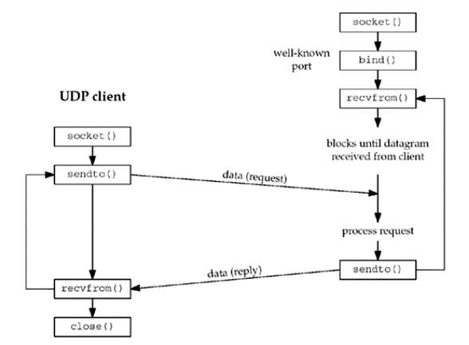
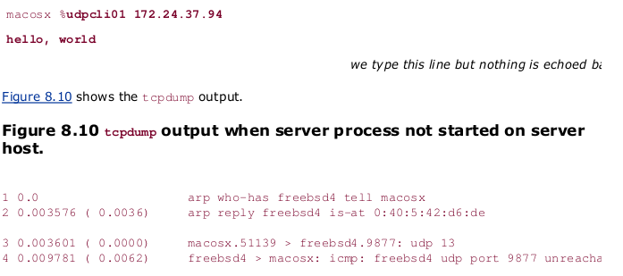

# 8.基本UDP套接字编程


<!-- @import "[TOC]" {cmd="toc" depthFrom=1 depthTo=6 orderedList=false} -->
<!-- code_chunk_output -->

* [8.基本UDP套接字编程](#8基本udp套接字编程)
	* [概述](#概述)
	* [recvfrom和sendto函数](#recvfrom和sendto函数)
	* [UDP回射服务器程序：main函数](#udp回射服务器程序main函数)
	* [UDP回射服务器程序：dg_echo函数](#udp回射服务器程序dg_echo函数)
	* [UDP回射客户程序：main函数](#udp回射客户程序main函数)
	* [UDP回射客户程序：dg_cli函数](#udp回射客户程序dg_cli函数)
	* [数据报丢失](#数据报丢失)
	* [验证接收到的响应](#验证接收到的响应)
	* [服务器进程未运行](#服务器进程未运行)
	* [UDP的connect函数](#udp的connect函数)
		* [给一个UDP套接字多次调用connect](#给一个udp套接字多次调用connect)
		* [性能](#性能)
	* [dg_cli函数(修订版)](#dg_cli函数修订版)
	* [UDP缺乏流量控制](#udp缺乏流量控制)
	* [UDP中的外出接口的确定](#udp中的外出接口的确定)
	* [使用select函数的TCP和UDP回射服务器程序](#使用select函数的tcp和udp回射服务器程序)
	* [部分习题](#部分习题)

<!-- /code_chunk_output -->


## 概述
UDP是无连接不可靠的数据报协议，非常不同于TCP提供的面向连接的可靠字节流。然而相比TCP，有些场合确实更适合使用UDP，使用UDP编写的一些常见的应用程序有：DNS、NFS、SNMP（简单网络管理协议）

典型的UDP客户/服务器程序的函数调用：


## recvfrom和sendto函数
这两个函数类似于标准的read和write函数，不过需要三个额外的参数。
```c
#include <sys/socket.h>

ssize_t recvfrom(int sockfd,void * buff,size_t nytes,int flags,struct sockaddr * from,socklen_t *addrlen);

ssize_t sendto(int sockfd,const void *buff,size_t nbytes,int flags,const struct sockaddr *to,socklen_t addrlen);
//均返回：若成功则为读或写的字节数，若出错则为-1
```
注意，sendto的最后一个参数是一个整数值，而recvfrom的最后一个参数是一个指向整数值的指针（值-结果）。

recvfrom的最后两个参数类似于accept的最后两个参数：返回时其中套接字地址结构的内容告诉我们是谁发送了数据报（UDP情况下）或是谁发起了连接（TCP情况下）。sendto的最后两个参数类似于connect的最后两个参数：调用时其中套接字地址结构被我们填入数据报将发往（UDP情况下）或与之建立连接（TCP情况下）的协议地址。

写一个长度为0的数据报是可行的。recvfrom返回0值是可接受的。

如果recvfrom的from参数是一个空指针，那么相应的长度参数也必须是一个空指针，表示我们并不关心数据发送者的协议地址。
recvfrom和sendto都可以用于TCP，尽管通常没有理由这么做。

## UDP回射服务器程序：main函数

```c
#include "unp.h"

int main(int argc, char const *argv[]) {
	int sockfd;
	struct sockaddr_in servaddr,cliaddr;

	sockfd=Socket(AF_INET,	SOCK_DGRAM,0);

	bzero(&servaddr,sizeof(servaddr));
	servaddr.sin_family=AF_INET;
	servaddr.sin_addr.s_addr=htonl(INADDR_ANY);
	servaddr.sin_port=htons(SERV_PORT);

	Bind(sockfd,(SA *)&servaddr,sizeof(servaddr));
	dg_echo(sockfd,(SA *)&cliaddr,sizeof(cliaddr));
	return 0;
}
```

## UDP回射服务器程序：dg_echo函数

```c
#include "unp.h"

void dg_echo(int sockfd,SA *pcliaddr,socklen_t clilen)
{
	int n;
	socklen_t len;
	char mesg[MAXLINE];

	while (1) {
		len=clien;
		n=Recvfrom(sockfd,mesg,MAXLINE,pcliaddr,&len);

		Sendto(sockfd,mesg,n,0,pcliaddr,len);
	}
}
```

## UDP回射客户程序：main函数
```c
#include "unp.h"

int main(int argc, char const *argv[]) {
	int sockfd;
	struct sockaddr_in servaddr;

	if (argc!=2)
		err_quit("usage:udpcli <IP Address>");

	bzero(&servaddr,sizeof(servaddr));
	servaddr.sin_family=AF_INET;
	servaddr.sin_port=htons(SERV_PORT);
	Inet_pton(AF_INET,argv[1],&servaddr.sin_addr);

	sockfd=Socket(AF_INET,SOCK_DGRAM,0);

	dg_cli(stdin,sockfd,(SA *)&servaddr,sizeof(servaddr));
	return 0;
}
```

## UDP回射客户程序：dg_cli函数
```c
#include "unp.h"

void dg_cli(FILE *fp,int sockfd,const SA * pservaddr,socklen_t servlen)
{
	int n;
	char sendline[MAXLINE],recvline[MAXLINE+1];

	while (Fgets(sendline,MAXLINE,fp)!=NULL)
	{
		Sendto(sockfd,sendline,strlen(sendline),0,pservaddr,servlen);

		n=Recvfrom(sockfd,recvline,MAXLINE,0,NULL,NULL);
		//注意，调用revfrom指定的第五个和第六个参数是空指针。
		//这告知内核我们并不关心应答数据报由谁发送，这样做存在一个风险。
		recvline[n]=0; //null terminate

		Fputs(recvline,stdout);
	}
}
```

## 数据报丢失
我们的UDP客户/服务器例子是不可靠的。如果一个客户数据报丢失（譬如说，被客户主机与服务器主机之间的某个路由器丢弃），客户将永远阻塞于dg_cli函数中的recvfrom调用，等待一个永远不会达到的服务器的应答。类似地，如果客户数据报到达服务器，但是服务器的应答丢失了，客户也将永远阻塞于recvfrom调用。
防止这样永久阻塞的一般方法是给客户的recvfrom调用设置一个超时。我们将在14章讨论。

仅仅给recvfrom调用设置超时并不是完整的解决办法。我们将在22章具体讨论如何给UDP客户/服务器程序增加可靠性。

## 验证接收到的响应

验证返回套接字地址的dg_cli函数版本：
```c
#include "unp.h"

void dg_cli(FILE *fp,int sockfd,const SA *pserveraddr,socklen_t servlen)
{
	int n;
	char sendline[MAXLINE],recvline[MAXLINE+1];
	socklen_t len;
	struct sockaddr * preply_addr;
	preply_addr=Malloc(servlen);

	while (Fgets(sendline,MAXLINE,fp)!=NULL) {
		Sendto(sockfd,sendline,strlen(sendline),0,pservaddr,servlen);

		len=servlen;
		n=Recvfrom(sockfd,sendline,MAXLINE,0,preply_addr,&len);
		if (len !=servlen || memcpy(pserveraddr,preply_addr,len)!=0)
		{
			printf("reply from %s (ignore)\n",Socket_ntop(preply_addr,len) );
			continue;
		}

		recvline[n]=0; //null terminate
		Fputs(recvline,stdout);
	}
}
```

如果服务器运行在一个只有单个IP地址的主机上，那么这个新版本的客户工作正常。然而如果服务器主机是多宿的，该客户就可能失败。

## 服务器进程未运行
我们下一个要检查的情形时在不启动服务器的前提下启动客户。如果我们这么做后在客户上键入一行文本，那么什么也不发生。客户永远阻塞于它的recvfrom调用，等待一个永不出现的服务器应答。

我们启动tcpdump，然后在同一个主机上启动客户，接着，我们键入一行文本，不过这行文本没有被回射。



在客户主机能够往服务器主机发送那个UDP数据报之前，需要一次ARP请求和应答的交换。

从第三行看到客户数据报发出，然而从第四行看到，服务器主机响应的是一个"port unreachable"ICMP消息。不过这个ICMP错误不返回给客户进程，客户永远阻塞于recvfrom调用。

我们称这个ICMP消息为异常错误。该错误由sendto引起，但是森电梯哦本身却成功返回。回顾第二章所述，我们知道从UDP输出操作成功返回仅仅表示在接口输出队列中具有存放所形成IP数据报的空间。该ICMP错误知道后来才返回，这就是称其为异步的原因。

一个基本规则是：对于一个UDP套接字，由它引发的异步错误并不返回给它，除非它已连接。我们将在后面章节讨论如何给UDP套接字调用connect。

## UDP的connect函数
在上一章节中我们提到，除非套接字已连接，否则异步错误是不会返回到UDP套接字的。我们确实可以给UDP套接字调用connect，然而这样做的结果却与TCP连接大相径亭：没有三路握手过程。内核值是检查是否存在立即可知的错误（例如一个显然不可达的目的地），记录对端的IPO地址和端口号（取自传递给connect的套接字地址结构），然后立即返回到调用进程。

* 未连接UDP套接字，新创建UDP套接字默认如此
* 已连接UDP套接字，对UDP套接字调用connect的结果
1. 我们再也不能给输出操作指定目的IP地址和端口号。也就是说，我们不是用sendto，而改用write或send
附：其实我们可以给已连接UDP套接字调用sendto，但是不能指定目的地址

2. 我们不必使用recvfrom以获取数据报的发送者，而改用read、recv或recvmsg。在一个已连接UDP套接字上，由内核为输入操作返回的数据报只有那些来自connect所指定协议地址的数据报。目的地为这个已连接UDP套接字的本地协议地址，发源地却不是该套接字早先connect到的协议地址的数据报，不会投递到该套接字。
这样就限制一个已连接UDP套接字仅且仅能与一个对端交换数据报。

3. 由已连接UDP套接字引发的异步错误回返回给他们所在的进程，而未连接UDP套接字不接收任何异步错误。

| 套接字类型 | write或send     | 不指定目的地址的sendto | 指定目的地址的sendto
| :------------- | :------------- | - |- |
|TCP | 可以 | 可以| EISCONN |
| udp，已连接| 可以 | 可以 | EISCONN |
|UDP，未连接 | EDESTADDRREQ | EDESTADDRREQ | 可以 |

作为小结，我们可以说UDP客户进程或服务器进程值在使用自己的UDP套接字与确定的唯一对端进行通信是，才可以调用connect。调用connect的通常是UDP客户，不过有些网络应用中的UDP服务器会与单个客户长时间通信（如TFTP），这种情况下服务器都可能调用connect。

### 给一个UDP套接字多次调用connect
拥有一个已连接UDP套接字的进程可出于下列两个目的之一再次调用connect：
* 指定新的IP地址和端口号
* 断开套接字：再次调用connect是把套接字地址结构的地址族成员（例如sin_family）设置为AF_UNSPEC。这么做可能会返回一个EAFNOSUPPORT错误，不过没有关系。

### 性能

当应用进程在一个为连接的UDP套接字上调用sendto是，源自berkeley的内核暂时连接在该套接字，发送数据报，然后断开连接。在一个未连接的UDP套接字上给两个数据报调用sendto函数涉及到下列6个步骤：
* 连接套接字
* 输出第一个数据报
* 断开套接字连接
* 连接套接字
* 输出第二个数据报
* 断开套接字连接

当应用进程知道自己要同以目的地址发送多个数据报时，显式的连接套接字效率更高。调用connect后调用两次write涉及内核执行下列步骤:
* 连接套接字
* 输出第一个套接字
* 输出第二个套接字

在这种情况下，内核只复制一次含有目的IP地址和端口号的套接字地址结构，相反当调用两次sendto时，需要复制两次。[Patridge 和 Pink 1993]指出，临时连接未连接的UDP套接字大约会耗费每个UDP传输三分之一的开销。

## dg_cli函数(修订版)
```c
#include "unp.h"

void dg_cli(FILE *fp,int sockfd,const SA * pservaddr,socklen_t servlen)
{
	int n;
	char sendlien[MAXLINE],recvline[MAXLINE+1];

	Connect(sockfd,(SA *)pservaddr,servlen);

	while (Fgets(sendline,MAXLINE,fp)!=NULL) {
		Write(sockfd,sendline,strlen(sendline));

		n=Read(sockfd,recvline,MAXLINE);

		recvline[n]=0; // null terminate
		Fputs(recvlien,stdout);
	}
}
```

## UDP缺乏流量控制

我们把dg_cli函数修改未发送固定数目的数据报，并不再从标准输入读。它写2000个1400字节大小的UDP数据报给服务器：
```c
#include "unp.h"

#define NDG 2000
#define DGLEN 1400

void dg_cli(FILE * fp,int sockfd,const SA * pservaddr,socklen_t servlen) {
	int i;
	char sendlien[MAXLINE];

	for (size_t i = 0; i < NDG; i++) {
		Sendto(sockfd,sendline,DGLEN,0,pservaddr,servlen);
	}
}
```

对接收到数据报进行计数的dg_echo函数:
```c
#include "unp.h"

static void recvfrom_int (int);
static int count;

void dg_echo(int sockfd,SA * pcliaddr,socklen_t clilen)
{
	socklen_t len;
	char msag[MAXLINE];
	Signal(SIGINT,recvfrom_int);

	while (1) {
		len=clilen;
		Recvfrom(sockfd,mesg,MAXLINE,0,pcliaddr,&len);
		count ++;
	}
}

staic void recvfrom_int(int signo)
{
	printf("\n received %d datagrams\n",count );
	exit(0);
}
```

书中所述，客户发出2000个数据报，但是服务器只收到30个，丢失率为98%。

UDP没有流量控制并且是不可靠的。该例表明较快的UDP发送端淹没其接收端时轻而易举的事情。

增大UDP接收缓冲区，稍有改善上述例子，不过仍不能从根本上解决问题：
```c
#include "unp.h"
static void recvfrom_int(int);
static int count;

void dg_echo(int sockfd,SA * pcliaddr,socklen_t clilen)
{
	int n;
	socklen_t len;
	char mesg[MAXLINE];

	Signal(SIGINT,recvfrom_int);

	n=220*1024;

	Setsockopt(sokfd,SOL_SOCKET,SO_RCVBUF,&n,sizeof(n));

	while (1) {
		len=clilen;
		Recvfrom(sockfd,mesg,MAXLINE,0,pcliaddr,&len);

		count ++;
	}
}

static void recvfrom_int(int signo)
{
	printf("\n received %d datagrams\n",count );
	exit(0);
}
```

## UDP中的外出接口的确定
已连接UDP套接字还可以用来确定用于特定目的地的外出接口。这是由connect函数应用到UDP套接字时的一个副作用造成的：内核选择本地IP地址（假设其进程未曾调用bind显式指派它）。这个本地IP地址通过为目的IP地址搜索路由表得到外出接口，然后选用该连接的主IP地址而选定。

下面给出了一个简单的UDP程序，它connect到一个指定的IP地址后调用getsockname得到本地IP地址和端口号并显示输出：
```c
#include "unp.h"

int main(int argc, char const *argv[]) {
	int sockfd;
	socklen_t len;
	struct sockaddr_in cliaddr,servaddr;

	if (argc !=2)
		err_quit("usage :udpcli <IPaddress>");

	sockfd=Socket(AF_INET,SOCK_DGRAM,0);

	bzero(&servaddr,sizeof(servaddr));
	servaddr.sin_family=AF_INET;
	servaddr.sin_port=htons(SERV_PORT);
	Inet_pton(AF_INET,argv[1],&servaddr.sin_addr);

	Connect(sockfd,(SA *)&servaddr,sizeof(servaddr));

	len=sizeof(cliaddr);
	Getsockname(sockfd,(SA *)&cliaddr,&len);
	printf("local address %s\n",Sock_ntop((SA *)&cliaddr,len));
	return 0;
}
```

运行：
```
[breap@breap udpcliserv]$ ./udpcli09 127.0.0.1
local address 127.0.0.1:56344
[breap@breap udpcliserv]$ ./udpcli09 45.36.89.126
local address 192.168.1.178:46698
[breap@breap udpcliserv]$ ./udpcli09 192.168.1.5
local address 192.168.1.178:49893
```
## 使用select函数的TCP和UDP回射服务器程序

```c
#include "unp.h"

int main(int argc, char const *argv[]) {
	int listenfd,connfd,udpfd,nready,maxfdp1;
	char mesg[MAXLINE];
	pid_t childpid;
	fd_set rset;
	ssize_t n;
	socklen_t len;
	const int on=1;
	struct sockaddr_in cliaddr,servaddr;
	void sig_chld(int);

	listenfd=Socket(AF_INET,SOCK_STREAM,0);

	bzero(&servaddr,sizeof(servaddr));
	servaddr.sin_family=AF_INET;
	servaddr.sin_port=htons(SERV_PORT);
	servaddr.sin_addr.s_addr=htonl(INADDR_ANY);

	Setsockopt(listenfd,SOL_SOCKET,SO_REUSEADDR,&on,sizeof(on));
	Bind(listenfd,(SA *)&servaddr,sizeof(servaddr));

	Listen(listenfd,LISTENQ);

	udpfd=Socket(AF_INET,SOCK_DGRAM,0);

	bzero(&servaddr,sizeof(servaddr));
	servaddr.sin_family=AF_INET;
	servaddr.sin_port=htons(SERV_PORT);
	servaddr.sin_addr.s_addr=htonl(INADDR_ANY);

	Bind(udpfd,(SA *)&servaddr,sizeof(servaddr));

	Signal(SIGCHLD,sig_chld); //must call waitpid()

	FD_ZRRO(&rset);
	maxfdp1=max(listenfd,udpfd)+1;

	while(1)
	{
		FD_SET(listenfd,&rset);
		FD_SET(udpfd,&rset);

		if ((nready=select(maxfdp1,&rset,NULL,NULL,NULL,NULL))<0)
		{
			if (errno==EINTR)
				continue;
			else
				err_sys("select error");
		}

		if (FD_ISSET(listenfd,&rset))
		{
			len=sizeof(cliaddr);
			connfd=Accept(listenfd,(SA *)&cliaddr,&len);

			if ((childpid=Fork())==0)
			{
				Close(listenfd);
				str_echo(connfd);
				exit(0);
			}
			Close(connfd);
		}

		if (FD_ISSET(udpfd,&rset))
		{
			len=sizeof(cliaddr);
			n=Recvfrom(udpfd,mesg,MAXLINE,0,(SA *)&cliaddr,&len);

			Sendto(udpfd,mesg,0,(SA *)&cliaddr,len);
		}
	}

	return 0;
}
```

## 部分习题
1. 我们有两个应用程序，一个使用TCP，另一个使用UDP。TCP套接字的接收缓冲区中有4096字节的数据，UDP套接字的接收缓冲区中有两个2048字节的数据。TCP应用程序调用read，指定其第三个参数为4096，UDP应用程序调用recvfrom，指定其第三个参数也为4096。这两个应用程序有什么差别吗？
答：有差别。read返回4096字节数据，recvfrom则返回2048字节（2个数据报中的第一个）。不管应用请求多大，recvfrom绝不会返回多于一个数据报的数据。

2. 我们说过每个已连接TCP套接字都有自己的套接字接收缓冲区。监听套接字情况怎么样？你认为它有自己的套接字接收缓冲区吗？
答：监听TCP套接字也许有一个套接字接收缓冲区大小，但是它绝不会接收数据。大多数实现并不预先给套接字发送缓冲区或接收缓冲区分配内存空间。使用SO_SNDBUF和SO_RCVBUF套接字选项指定的套接字选项指定的套接字缓冲区大小仅仅时给套接字设定的上限。


[上一级](base.md)
[上一篇](7_socket_opt.md)
[下一篇](11_name_addr.md)
