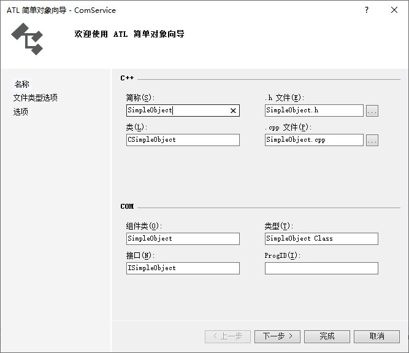

# 组件对象模型 (COM)

<!-- @import "[TOC]" {cmd="toc" depthFrom=1 depthTo=6 orderedList=false} -->

<!-- code_chunk_output -->

- [组件对象模型 (COM)](#组件对象模型-com)
  - [简介](#简介)
  - [线程化与套间](#线程化与套间)
  - [创建 COM 调用 64 位动态库来让 32 位程序使用](#创建-com-调用-64-位动态库来让-32-位程序使用)
    - [创建一个进程外COM服务器(EXE)](#创建一个进程外com服务器exe)
    - [手动注册COM服务器](#手动注册com服务器)
    - [其他程序调用COM接口](#其他程序调用com接口)
      - [方法一](#方法一)
      - [方法二](#方法二)
  - [Link](#link)

<!-- /code_chunk_output -->

## 简介
组件对象模型（英语：Component Object Model，缩写COM）是微软的一套软件组件的二进制接口标准。这使得跨编程语言的进程间通信、动态对象创建成为可能。COM是多项微软技术与框架的基础，包括OLE、OLE自动化、ActiveX、COM+、DCOM、Windows shell、DirectX、Windows Runtime。详见 [组件对象模型](https://zh.wikipedia.org/wiki/%E7%BB%84%E4%BB%B6%E5%AF%B9%E8%B1%A1%E6%A8%A1%E5%9E%8B)

## 线程化与套间
一个进程加载了一个COM的DLL文件后，该DLL可能定义并使用了一些可修改的全局变量或访问共享资源。该进程内的多个线程如何并发访问该DLL并保证是线程安全的，这就是“套间”（apartment）技术需要解决的问题。

COM对象与创建或调用COM对象的线程可以按两种策略来实现并发安全：

* 按照单线程执行方式写COM对象的代码，完全不考虑并发执行问题。这样的每个COM对象只能由一个线程执行，该线程通过Windows消息队列实现多线程访问该COM对象被串行化从而并发安全。这种策略称作单线程套间（Single-Threaded Apartment，STA）。
* COM对象的代码自身实现了并发控制（通过Windows互斥原语，如互斥锁、临界区、事件、信号量等）。因此实际上多线程可以直接调用该COM对象的方法，这是并发安全的。这种策略称作多线程套间（Multi-Threaded Apartment，MTA）。

COM的并发安全的具体实现，提出了套间（apartment）概念。每一种套间类型表示在一个进程内部是多线程情况下，如何同步对COM对象的调用。套间是一个逻辑容器，收纳遵循相同线程访问规则的COM对象与COM线程（创建了COM对象的线程或者调用了COM对象的方法的线程）。套间本质上只是一个逻辑概念而非物理实体，没有句柄类型可以引用它，更没有可调用的API操纵它。套间有两种：

* 单线程套间（Single-Threaded Apartment，STA）：每个进程可以有多个STA套间。每个STA套间只能有一个线程。每个STA性质的COM对象只能属于一个STA套间。一个STA套间可以有零个或多个STA属性的COM对象，这些COM对象的方法只能由该套间的唯一线程执行。STA套间的线程可以直接调用该套间的COM对象的方法。如果STA套间的COM对象被套间外的线程或进程调用，那么该套间的线程必须实现Windows消息队列与消息循环处理机制，其他线程必须通过marshalling与unmarshalling机制，通过给该STA套间的线程发送Windows消息来调用COM对象。每个STA性质的线程自动形成一个STA套间，这个套间容纳了该线程及其创建的所有STA性质COM对象。MTA性质的线程创建STA性质的COM对象时，系统自动把该COM对象放在default STA套间内，由该套间的STA线程来执行该COM对象的方法。每个进程至多有一个default STA套间，该套间与套间内线程是自动生成的。
* 多线程套间（Multi-Threaded Apartment，MTA）：每个进程至多有一个MTA套间。所有MTA性质的线程都属于MTA套间。所有MTA性质的COM对象也都属于这个MTA套间。STA性质的线程创建MTA性质的COM对象时，系统自动创建一些线程以执行这些MTA性质的COM对象，这些线程也属于MTA套间，系统返回安整后的COM对象的描述给STA性质的线程。
一个COM对象只能存在于一个套间。COM对象一经创建就确定所属套间，并且直到销毁它一直存在于这个套间。COM对象有4种套间模式：单线程套间（Single Threading Apartment，STA），多线程套间（MTA），线程中立套间（Thread Neutral Apartment，NA），以及Both(STA+MTA)。

一个COM线程从创建到结束都属于同一个套间。COM线程只有两种套间模式：STA或MTA。线程必须通过调用CoInitializeEx()函数并且设定参数为COINIT_APARTMENTTHREADED或者COINIT_MULTITHREADED，来指明该线程的套间模式。调用了CoInitializeEx()函数的线程即已进入套间，直到线程调用CoUninitialize()函数或者自身终止，才会离开套间。COM为每个STA的线程自动创建了一个隐藏窗口，其Windows class是"OleMainThreadWndClass" 。跨套间调用这个STA套间内的COM对象，实际上是向这个隐藏窗口发送了一条窗口消息，通过消息循环与分派，该窗口过程收到这条窗口消息并调用相应的COM对象的接口方法。

线程与属于同一套间的对象遵循相同的线程访问规则，可以直接执行方法调用而不需COM的辅助。线程跨套间边界去调用COM对象，传递的指针需要marshalling。如果通过标准的COM的API来调用，可以自动完成安整。例如，把一个COM接口指针作为参数传递给另外一个套间的COM对象的proxy的情形。但如果软件编程者跨套间传递接口指针而没有使用标准COM机制，就需要手工完成安整（通过CoMarshalInterThreadInterfaceInStream函数）与反安整（通过CoGetInterfaceAndReleaseStream函数获取COM接口的proxy）。例如，把COM接口指针作为线程启动时的参数传递的情形。

跨进程的调用COM对象类似于同一进程内跨套间的调用COM对象

| 套间类型                                                   | 描述                                                                                                                                                                                                                                                                                                                                                                                                                                                                                                                                                                                                                                                                                 |
| ---------------------------------------------------------- | ------------------------------------------------------------------------------------------------------------------------------------------------------------------------------------------------------------------------------------------------------------------------------------------------------------------------------------------------------------------------------------------------------------------------------------------------------------------------------------------------------------------------------------------------------------------------------------------------------------------------------------------------------------------------------------ |
| 单线程套间[14]（STA），（ThreadingModel=Apartment）        | 一个单独的线程专门用于执行COM对象的方法。如果是STA的COM线程创建了STA的COM对象，这个COM对象的方法就由该线程执行，该线程调用该COM对象是直接调用。如果MTA的COM线程创建了STA的COM对象，系统在当前进程内自动创建一个default STA线程来执行该STA的COM对象的方法，并把COM对象的proxy返回该MTA的线程。COM对象所在STA套间之外的线程调用该COM对象的方法，需要对COM对象的指针先做marshalling再由操作系统自动排队（通过该COM对象被调用方法所在的线程的标准的Microsoft Windows的消息循环）。这提供了自动同步以确保对象的方法每次调用执行完毕后才能启动方法的新的调用。开发者不需要担心线程加锁（locking）或竞态条件。如果跨套间调用STA的COM对象，该对象所在STA的线程必须提供线程消息循环处理机制。 |
| 多线程套间[15]（MTA），（ThreadingModel=Free）             | COM运行时不提供同步，多个MTA线程可以同时调用同一个MTA的COM对象，由各个MTA线程直接执行COM对象的方法，且因为在同一个MTA中因此不需要安整。COM对象需要自己实现同步控制以避免多线程同时访问造成的竞态条件或死锁。STA的线程创建MTA的COM对象，系统自动创建一个或多个线程来执行MTA的COM对象。STA线程调用MTA的COM对象也需要marshalling，系统自动分配某个自动创建的线程来执行COM对象。MTA的优点是提高了并发处理性能，同时工作线程不需要有自己的Windows消息循环。                                                                                                                                                                                                                               |
| 自动选择套间[16]，（ThreadingModel=Both）                  | COM对象创建时系统自动选择STA或MTA，以匹配主调线程的套间类别。这避免了很多marshalling开销，例如一个MTA服务器被一个STA线程调用。                                                                                                                                                                                                                                                                                                                                                                                                                                                                                                                                                       |
| Thread Neutral Apartment（NA），（ThreadingModel=Neutral） | 一个特殊的套间，没有任何指定的线程。当STA或MTA线程调用同一进程的NA对象，则调用线程临时离开它的套间并执行COM对象的代码，没有任何线程切换。即任何线程都可以直接了当调用COM对象的方法。[17]因此NA可以认为是优化套间之间方法调用的效率。                                                                                                                                                                                                                                                                                                                                                                                                                                                 |

详见：[线程化与“套间”](https://zh.wikipedia.org/wiki/%E7%BB%84%E4%BB%B6%E5%AF%B9%E8%B1%A1%E6%A8%A1%E5%9E%8B#%E7%BA%BF%E7%A8%8B%E5%8C%96%E4%B8%8E%E2%80%9C%E5%A5%97%E9%97%B4%E2%80%9D)

## 创建 COM 调用 64 位动态库来让 32 位程序使用
主要目的是：创建 COM 调用 64 位动态库来让 32 位程序使用,这里省略了调用库的操作，在实际使用中只需要ComService.exe和相关依赖文件以及正确的注册表。在将工程部署到别的机器上，在没有开发环境的时候可选择手动注册 COM 服务。

### 创建一个进程外COM服务器(EXE)
* 创建 ATL 项目,eg: ComService


* 添加一个类 ,eg: SimpleObject 


然后一直下一步
* 切换到类视图，选中 ISimpleObject,然后右键添加->添加方法

这里一定要注意参数类型要正确，如果 COM不支持某种类型，这是能够成功生成执行文件，但客户调用该程序会出现 “不正确的变量类型”；

* 然后使用管理员权限启动该项目生成即可
生成工程过程中会自动注册 COM 服务器（若注册失败，可检查是否缺少相应的依赖文件），也可手动注册 COM　服务器

### 手动注册COM服务器
以管理员权限启动powershell（或者CMD） 运行：`　*.exe /regserver  (注销 *.exe /unregserver)`

### 其他程序调用COM接口
#### 方法一
```c++
#include "stdafx.h"
#include <iostream>
 
#include "../../ComService/ComService/ComService_i.h"
#include "../../ComService/ComService/ComService_i.c"
 
 
int test(int num1, int num2)
{
	CoInitialize( NULL );
 
	COSERVERINFO si;
	MULTI_QI     qi;
 
	ZeroMemory( &si, sizeof( si ) );
	ZeroMemory( &qi, sizeof( qi ) );
 
	si.pwszName = L"127.0.0.1";//自己机器的IP
	si.pAuthInfo = NULL;
 
	qi.pIID = &IID_ISimpleObject;
	qi.pItf = NULL;
 
	long hr = CoCreateInstanceEx(CLSID_SimpleObject, NULL, CLSCTX_REMOTE_SERVER, &si, 1, &qi);
	if( FAILED( hr ) || FAILED(qi.hr) )
	{
		return -1;	//连接服务器失败
	}
 
	ISimpleObject * pT = NULL;
	qi.pItf->QueryInterface( &pT );
	qi.pItf->Release();
 
	long np = pT->ComServiceAdd(num1, num2, (long *)&sum);
 
	pT->Release();
 
	CoUninitialize();
}
 
 
int _tmain(int argc, _TCHAR* argv[])
{
 
	int num1 = 10;
	int num2 = 20;
	test(num1, num2);
	return 0;
}
```
#### 方法二
```c++
CoInitialize( NULL );
CComQIPtr<ISimpleObject> simpleObj;
long hr = simpleObj.CoCreateInstance(CLSID_Driver);
if (FAILED( hr ))
{
	return ;	//连接服务器失败
}
simpleObj.test(1,2);
CoUninitialize();
```


## Link 
* [64位进程调用32位DLL详解](https://blog.csdn.net/nie2314550441/article/details/49867735)
* [32bit程序调用64bit dll 的解决办法](https://blog.csdn.net/shakesky/article/details/23265811)
* [组件对象模型 wikipedia](https://zh.wikipedia.org/wiki/%E7%BB%84%E4%BB%B6%E5%AF%B9%E8%B1%A1%E6%A8%A1%E5%9E%8B)
* [C++ (Cpp) CoInitializeEx Examples](https://cpp.hotexamples.com/examples/-/-/CoInitializeEx/cpp-coinitializeex-function-examples.html)

[上一级](README.md)
[下一篇 -> 将中文docx文档转换为英文文档](DocZhToEn.md)
