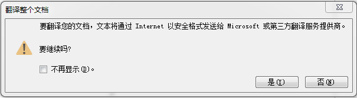
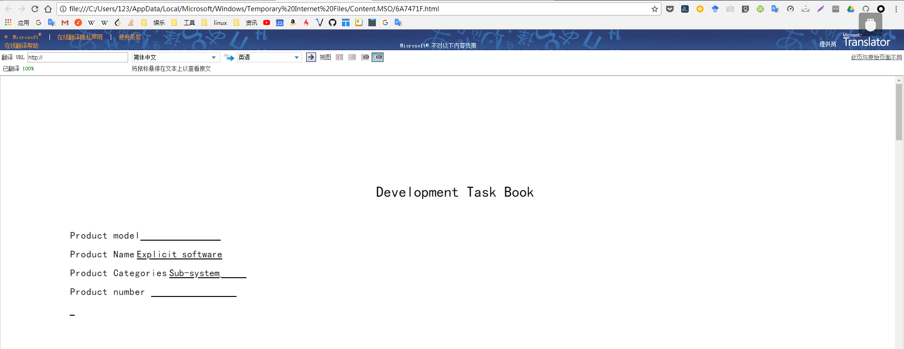
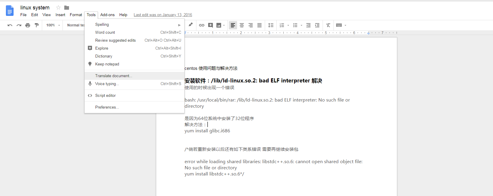
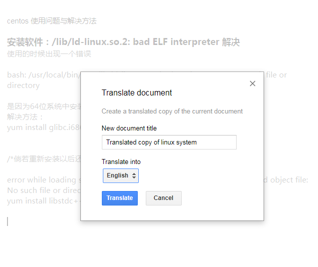
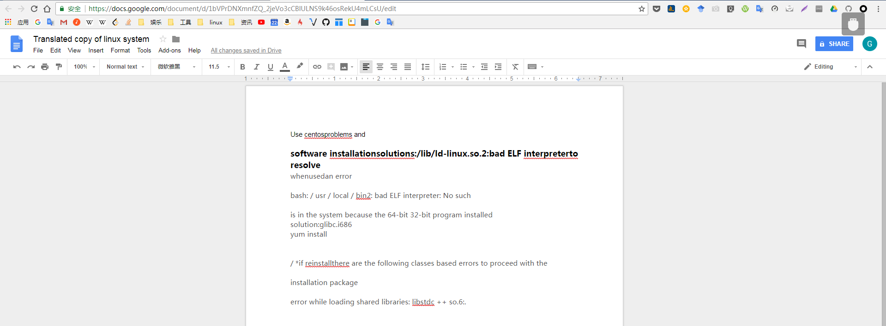
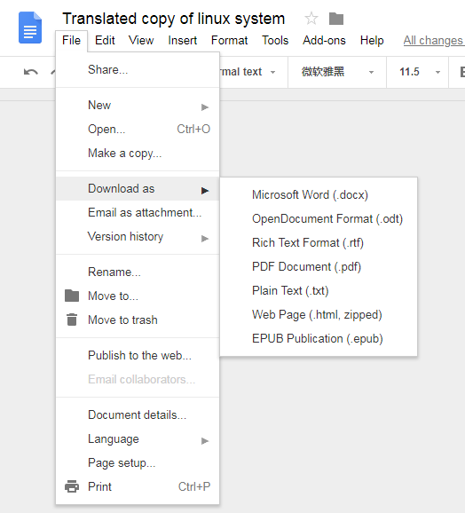

# 将中文docx文档转换为英文文档

<!-- @import "[TOC]" {cmd="toc" depthFrom=1 depthTo=6 orderedList=false} -->
<!-- code_chunk_output -->

* [将中文docx文档转换为英文文档](#将中文docx文档转换为英文文档)
	* [使用 office 2016 自带的翻译功能](#使用-office-2016-自带的翻译功能)
	* [利用 google doc 网页版提供的翻译功能](#利用-google-doc-网页版提供的翻译功能)

<!-- /code_chunk_output -->

## 使用 office 2016 自带的翻译功能

点击翻译后，会跳转到浏览器，并显示翻译后的结果，在这个网页中并没有下载选项，只是可以将该网页的元素复制下来，但复制相关内容下来后排版乱了，并且目录等结构已被更改。

[如何将整篇英文word文档翻译为中文](https://jingyan.baidu.com/article/cbf0e500efcf5c2eaa2893f5.html)

## 利用 google doc 网页版提供的翻译功能

上传文件到 google doc：

下载 docx 文件：

Google Doc 支持多种输出格式，转换效果也比 office 的好
---
- [上一级](README.md)
- 上一篇 -> [组件对象模型 (COM)](COM.md)
- 下一篇 -> [Visual studio 安装 Visual Assist](VisualStudioInstallVisualAssist.md)
