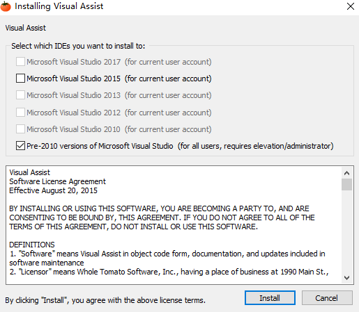

# Visual studio 安装 Visual Assist


<!-- @import "[TOC]" {cmd="toc" depthFrom=1 depthTo=6 orderedList=false} -->
<!-- code_chunk_output -->

* [Visual studio 安装 Visual Assist](#visual-studio-安装-visual-assist)
	* [Visual Assist 概览](#visual-assist-概览)
	* [crack visual Assist](#crack-visual-assist)
	* [VisualStudio 2008 install visual assist](#visualstudio-2008-install-visual-assist)

<!-- /code_chunk_output -->


## Visual Assist 概览

Visual Assist具有丰富的功能来提高开发人员的生产力。借助Visual Assist包含的众多功能，可以让您的 visual stduio 更好用。

[Visual Assist offical website](https://www.wholetomato.com/default.asp)

## crack visual Assist

[Download crack Files](https://www.worldsrc.com/programs/crack.php?Ty=429&n=crack_For_Whole_Tomato_Visual_Assist_X)

Open crack file,and you can see this:

```highlight
INSTALLATION

0) Uninstall VA (if you have installed it before).
0.0) Manually check for alive _folders_ of pervious version of VA in extensions folders (paths are described
below) and remove them by yourself, because of VA uninstaller's bug
1) Locate all places where va_x.dll's are reside in your MSVCs (paths are described below)
2) Replace all found va_x.dll with our one
3) PROFIT (you may see "License: trial" - don't worry, all should work without any limitation)


Places where Visual Assist extension (va_x.dll and another stuff) resides in different versions of MS Visual Studio are listed below:

-------------------
MSVC version | path
-------------------
msvc2008     | find in installation path (by default c:\Program Files (x86)\Visual Assist X\)

msvc2010     | %USERPROFILE%\AppData\Local\Microsoft\VisualStudio\10.0\Extensions\Whole Tomato Software\Visual Assist\__version__\

msvc201[1|2] | %USERPROFILE%\AppData\Local\Microsoft\VisualStudio\11.0\Extensions\__random_dir__\

msvc2013     | %USERPROFILE%\AppData\Local\Microsoft\VisualStudio\12.0\Extensions\__second_random_dir__\

msvc2015     | %USERPROFILE%\AppData\Local\Microsoft\VisualStudio\14.0\Extensions\__random_dir__\

msvc2017     | %USERPROFILE%\AppData\Local\Microsoft\VisualStudio\15.0__%XXX%\Extensions\__second_random_dir__\
-------------------

Notes: in my case
__version__ is "10.9.2238.2"
__random_dir__ and __second_random_dir__ are generated and looks like "v3tpxirz.5pr"

WorldSrc.com
```

## VisualStudio 2008 install visual assist

以管理员权限运行该安装程序，运行后如下图所示：



点击安装就可以给 VisualStudio 2008 安装 Visual assist。

[上一级](base.md)
[上一篇](DocZhToEn.md)
[下一篇](insertUSBDevicesNotResponse.md)
