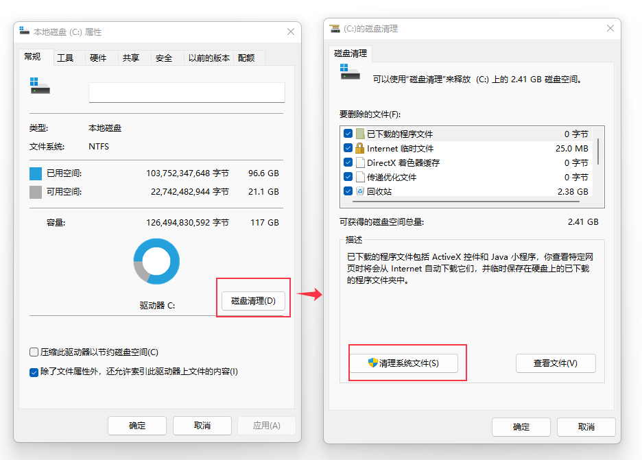
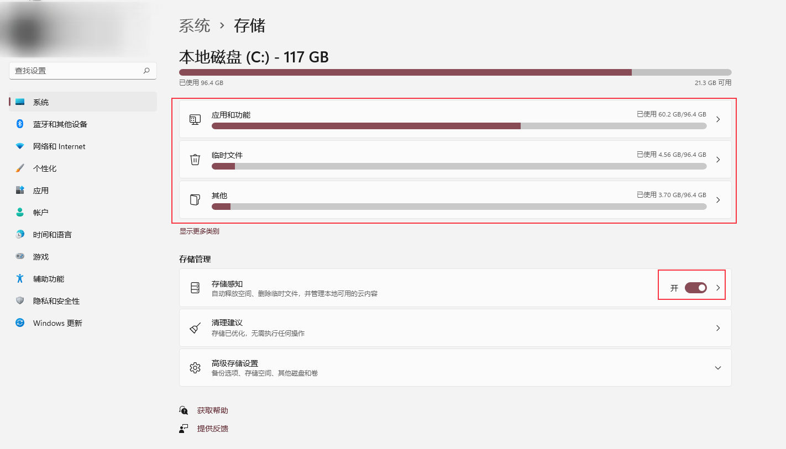
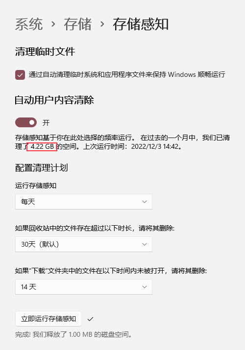
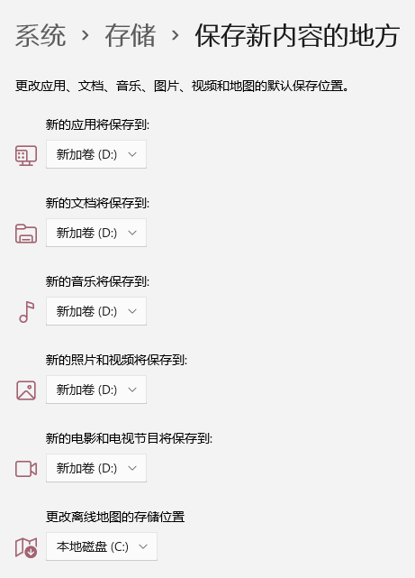

<!-- Windows 11 C 盘瘦身 -->
- [基础篇](#基础篇)
- [高级篇](#高级篇)
  - [卸载不常用的软件](#卸载不常用的软件)
  - [使用分析工具查找大文件](#使用分析工具查找大文件)

# 基础篇

1. 选中 C 盘->属性->磁盘清理->清理系统文件（如下图所示）。选中要清理的项

2. 打开设置->系统->存储，待分析完后，即可得到对应的文件类型分布，如下图所示：

3. 开启存储感知。可设置成下图这样：

4. 更改保存新内容的地方到其他盘。可设置成下图这样：

5. 打开清理建议，可清理一些东西。如下图所示：

# 高级篇

## 卸载不常用的软件

可使用开源工具  [Bulk Crap Uninstaller](https://www.bcuninstaller.com/)

它是一个免费的批量程序卸载程序，具有高级自动化功能。它擅长删除大量应用程序，只需很少或没有用户输入，同时几乎不需要任何技术知识。
它可以检测大多数应用程序和游戏（甚至是便携式或未注册）、清理剩余内容、强制卸载、根据预制列表自动卸载等等。

## 使用分析工具查找大文件

可使用 [WinDirStat](https://windirstat.net/)

它是磁盘使用情况统计查看器和清理工具，适用于各种版本的Microsoft Windows。

---

- [上一级](README.md)
- 上一篇 -> [Visual studio 安装 Visual Assist](VisualStudioInstallVisualAssist.md)
- 下一篇 -> [Win 10 插入U盘后，听见插入提示音，但在我的电脑里没有相应的入口](insertUSBDevicesNotResponse.md)
